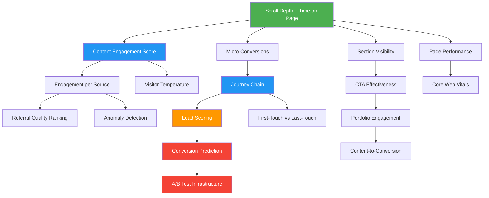

# Стратегия продвинутого трекинга — идеи для dima-razrab.com

> **Контекст:** Уже реализован трекинг кликов с SEO-данными (search_engine, search_query, UTM, device, browser, OS), привязка кликов к работам/категориям, конверсии (contact form), per-page аналитика (CTR, матрица «страница × источник»), дашборд в sqladmin с Chart.js.
>
> **Цель:** Идеи, которые дадут **аналитическое преимущество над Яндекс.Метрикой** — то, что стандартные счётчики НЕ умеют или умеют хуже.

---

## A. Глубина вовлечения (Engagement Depth)

### 1. Scroll Depth Distribution — распределение глубины прокрутки
**Что:** Отслеживаем процент прокрутки каждой страницы (25% / 50% / 75% / 100%) и сохраняем не среднее, а **распределение** — сколько пользователей дошли до каждого порога.

**Почему круто:** Яндекс.Метрика показывает среднюю глубину скролла — бесполезная метрика. Распределение покажет, что, например, 60% посетителей страницы «Обо мне» видят только первый экран, а на странице работы «E-commerce проект» 80% долистывают до конца. Это сигнал: «Обо мне» теряет внимание после первого экрана.

**Реализация:**
- Фронтенд: `IntersectionObserver` на невидимых «маяках» в DOM на 25/50/75/100% высоты страницы. При пересечении — отправляем событие `POST /event` с типом `scroll_depth` и значением процента.
- Бэкенд: Новая таблица `page_events` с полями: `session_id`, `url`, `event_type`, `value`, `timestamp`. Агрегация через SQL `GROUP BY url, value` → распределение.
- Дашборд: stacked bar chart — для каждой страницы показать % пользователей на каждом пороге.

**Бизнес-ценность:** Понимаем, какой контент «мёртвый» (никто не видит) и где ставить CTA-кнопки (над уровнем отсева).

**Сложность:** Легко
**Приоритет:** Высокий

---

### 2. Time-on-Page Segments — сегментация по времени на странице
**Что:** Группируем визиты по времени на странице: «мгновенный уход» (0–10 сек), «сканирование» (10–30 сек), «чтение» (30–120 сек), «глубокое изучение» (120+ сек).

**Почему круто:** Метрика показывает «качество внимания». Если 70% визитов на страницу портфолио — «мгновенный уход», это сигнал о проблеме с первым экраном. А если 40% на странице контактов — «глубокое изучение» (>2 мин), значит, человек реально думает перед заявкой.

**Реализация:**
- Фронтенд: `performance.now()` при загрузке и `beforeunload`/`visibilitychange` для фиксации времени. Отправляем `time_on_page` при уходе со страницы.
- Бэкенд: Добавить поле `time_on_page_seconds` в `clicks` или новую таблицу `page_sessions`. Сегментация — на уровне SQL-запроса с `CASE WHEN`.

**Бизнес-ценность:** Понимаем, какие страницы «цепляют», а какие отталкивают. Коррелируем время на странице с конверсией.

**Сложность:** Легко
**Приоритет:** Высокий

---

### 3. Content Engagement Score — комбинированная метрика вовлечённости
**Что:** Единая оценка (0–100) для каждого визита: `score = scroll_depth * 0.3 + time_on_page_normalized * 0.3 + interactions_count * 0.2 + cta_visible * 0.2`.

**Почему круто:** Вместо трёх отдельных метрик — один «температуляр» визита. Можно агрегировать по источникам трафика и понять, какой канал приносит **самых вовлечённых** посетителей, а не просто «самых многочисленных».

**Реализация:**
- Фронтенд: Собираем все компоненты (scroll, time, клики, видимость CTA) и отправляем `engagement_score` при уходе.
- Бэкенд: Формула расчёта на бэкенде (чтобы можно было менять веса без деплоя фронтенда). Храним в `page_sessions.engagement_score`.

**Бизнес-ценность:** Ранжируем источники трафика не по количеству, а по качеству. «Хабр даёт 50 визитов/мес с engagement 72, а ВКонтакте — 200 визитов с engagement 31».

**Сложность:** Средне
**Приоритет:** Высокий

---

### 4. Rage Clicks — обнаружение фрустрации
**Что:** Детектируем быстрые повторные клики (3+ клика по одному элементу за 1 секунду) — классический признак фрустрации: пользователь жмёт, а ничего не происходит.

**Почему круто:** Яндекс.Метрика вообще не знает об этой метрике. Rage clicks мгновенно показывают «сломанные» элементы интерфейса — кнопки, которые выглядят кликабельными, но не работают, или элементы с задержкой.

**Реализация:**
- Фронтенд: Обработчик `click` на `document`, буфер последних 5 кликов. Если 3+ клика по элементу (или его parent) за 1 сек → отправляем `rage_click` с `selector` элемента и `url`.
- Бэкенд: Таблица `frustration_events` (session_id, url, event_type, element_selector, timestamp). Дашборд — топ элементов с rage clicks.

**Бизнес-ценность:** Находим UX-баги, которые убивают конверсию, до того как клиент пожалуется.

**Сложность:** Легко
**Приоритет:** Средний

---

### 5. Dead Clicks — клики по неинтерактивным элементам
**Что:** Пользователь кликнул по элементу, который не является ссылкой, кнопкой или интерактивным — значит, он **ожидал**, что элемент кликабелен.

**Почему круто:** Это прямой сигнал о проблемах с дизайном. Если 30% кликов на странице работы приходятся на изображение, которое не открывается в полном размере — это потерянная конверсия.

**Реализация:**
- Фронтенд: На каждый `click` проверяем, является ли `event.target` (или его parent) интерактивным (`<a>`, `<button>`, `[role="button"]`, `[onclick]`). Если нет → `dead_click` с селектором.
- Бэкенд: Аналогично rage clicks, отдельный `event_type`.

**Бизнес-ценность:** Превращаем «мёртвые» клики в конверсии — добавляем ожидаемую интерактивность.

**Сложность:** Легко
**Приоритет:** Средний

---

### 6. Time to First Interaction — скорость первого контакта
**Что:** Сколько миллисекунд проходит от загрузки страницы до первого действия пользователя (клик, скролл, ввод текста).

**Почему круто:** Если TTFI > 5 секунд — пользователь «завис», не понимает что делать. Если TTFI < 1 секунда — сразу нашёл нужное (или сразу ушёл). Корреляция TTFI с конверсией покажет оптимальный дизайн первого экрана.

**Реализация:**
- Фронтенд: `performance.now()` при `DOMContentLoaded` + первый слушатель `click`/`scroll`/`keydown`. Разница — TTFI.
- Бэкенд: Поле `time_to_first_interaction_ms` в `page_sessions`.

**Бизнес-ценность:** Оптимизация above-the-fold контента. Сравнение TTFI между страницами покажет, где UX лучше.

**Сложность:** Легко
**Приоритет:** Средний

---

## B. Путь к конверсии (Conversion Intelligence)

### 7. Journey Chain Reconstruction — полный путь до заявки
**Что:** Реконструируем полную последовательность страниц, которые посетитель просмотрел ДО отправки формы контакта. Не просто «пришёл с Google на страницу X», а «Google → главная → портфолио → работа Y → контакты → заявка».

**Почему круто:** Яндекс.Метрика показывает «путь» в общем виде, но не привязывает его к конкретной конверсии. Здесь каждая заявка имеет персональную историю пути. Можно ответить: «Из 50 заявок за месяц — 35 прошли через страницу работы X, а 10 — через страницу категории Y».

**Реализация:**
- Фронтенд: `sessionStorage` хранит массив `{url, timestamp}` — история переходов в рамках сессии. При отправке `/contact` передаём `attribution.journey` (уже есть в `AttributionModel`!).
- Бэкенд: Новая таблица `conversion_journeys` (contact_id, journey_json, pages_count, entry_url, conversion_url). Агрегация: топ последовательностей.

**Бизнес-ценность:** Знаем, какие страницы — «мосты к конверсии». Усиливаем их SEO и дизайн.

**Сложность:** Средне (фронтенд уже передаёт journey, нужно сохранять и анализировать)
**Приоритет:** Высокий

---

### 8. Micro-Conversions — промежуточные целевые действия
**Что:** Треким не только финальную заявку, но и промежуточные действия: скролл до формы контактов, клик на «Посмотреть работу», открытие портфолио, копирование email/телефона, клик на ссылку Telegram.

**Почему круто:** Показывает «воронку вовлечения» внутри одного визита. Если 100 человек открыли портфолио, 40 кликнули на работу, 10 долистали до формы, 3 отправили — мы знаем, где теряем 60% на втором шаге.

**Реализация:**
- Фронтенд: Набор `data-micro-conversion="portfolio-open"`, `data-micro-conversion="work-click"`, `data-micro-conversion="form-scroll"` на ключевых элементах. Единый обработчик `click` проверяет атрибут.
- Бэкенд: Таблица `micro_conversions` (session_id, url, conversion_type, timestamp). Дашборд — воронка: показ → клик → скролл к форме → заявка.

**Бизнес-ценность:** Видим воронку ДО конверсии. Оптимизируем шаг, где теряем больше всего.

**Сложность:** Средне
**Приоритет:** Высокий

---

### 9. First-Touch vs Last-Touch Attribution — двойная атрибуция
**Что:** Для каждой конверсии храним два источника: **first-touch** (как пользователь впервые попал на сайт) и **last-touch** (откуда пришёл непосредственно перед заявкой).

**Почему круто:** «Хабр привёл 3 визита, а Яндекс.Директ — 50 визитов и 2 заявки». Кажется, Директ лучше? Но если first-touch анализ покажет, что все 2 заявки Директа пришли от людей, которые сначала прочитали статью на Хабре — ценность Хабра кардинально меняется.

**Реализация:**
- Фронтенд: `localStorage` хранит `first_visit_source` (из первого визита) и обновляет `last_visit_source` при каждом визите. Оба передаются в `/contact` через `attribution.entry` и текущий UTM.
- Бэкенд: В таблице `contact` (или `conversion_journeys`) — поля `first_touch_source`, `first_touch_medium`, `last_touch_source`, `last_touch_medium`.

**Бизнес-ценность:** Правильное распределение бюджета между каналами. Не «что приводит клики», а «что запускает цепочку, ведущую к деньгам».

**Сложность:** Средне
**Приоритет:** Высокий

---

### 10. Return Visitor Behavior — поведение возвращающихся
**Что:** Разделяем поведение новых и возвращающихся visitors (по `localStorage` fingerprint). Сравниваем: какие страницы смотрят возвращающиеся, как меняется engagement, какова конверсия по визитам.

**Почему круто:** Возвращающийся visitor — это «тёплый лид». Если 70% конверсий приходятся на 2-й+ визит, значит, сайт работает как «медленный конвертер» и нужно оптимизировать возвращение (remarketing, закладки, email-цепочки).

**Реализация:**
- Фронтенд: `localStorage` с `visit_count`, `first_visit_date`, `last_visit_date`. При каждом визите инкрементируем. Передаём в `attribution.visits`.
- Бэкенд: В `clicks` — поле `visit_number` (1, 2, 3...). Аналитика: конверсия по номеру визита, среднее визитов до конверсии.

**Бизнес-ценность:** Понимаем, сколько «касаний» нужно для конверсии. Планируем remarketing-стратегию.

**Сложность:** Легко
**Приоритет:** Средний

---

## C. Качество трафика (Traffic Quality)

### 11. Engagement Score per Source — качество трафика по каналам
**Что:** Для каждого источника трафика (Google organic, Яндекс, Хабр, ВКонтакте, direct) считаем средний engagement score (из идеи №3), глубину скролла, время на сайте и конверсию.

**Почему круто:** Стандартный view: «Яндекс дал 500 визитов, Google — 200». С этим трекингом: «Яндекс дал 500 визитов с engagement 35 и конверсией 0.4%, Google — 200 визитов с engagement 71 и конверсией 2.1%». Google в 5 раз эффективнее, хотя даёт в 2.5 раза меньше трафика.

**Реализация:**
- Бэкенд: JOIN `clicks` + `page_sessions` (или агрегация time_on_page из click events). `GROUP BY utm_source / search_engine / referer_domain`. Материализованное view или кэшированный отчёт в `SeoStatsService`.
- Дашборд: Таблица с сортировкой по engagement score, цветовая индикация (зелёный > 60, жёлтый 30–60, красный < 30).

**Бизнес-ценность:** Перераспределяем усилия с «много трафика» на «качественный трафик».

**Сложность:** Средне
**Приоритет:** Высокий

---

### 12. Bounce Quality — осмысленный показатель отказов
**Что:** Переопределяем «отказ»: не просто «1 страница за визит», а учитываем время и действия. «Хороший bounce»: 30+ секунд на странице контактов (человек записал телефон). «Плохой bounce»: 0–5 секунд на любой странице.

**Почему круто:** Яндекс.Метрика считает отказом любой визит из 1 страницы. Но если человек пришёл из поиска по запросу «дима разработчик контакты», нашёл номер и ушёл — это **успешный визит**, а не отказ.

**Реализация:**
- Бэкенд: При агрегации bounce rate — сегментация: `quality_bounce` (time > 30 сек или scroll > 50%), `quick_bounce` (time < 5 сек), `standard_bounce` (остальные). Два bounce rate: стандартный и «осмысленный».
- Дашборд: Два показателя рядом: «Bounce Rate: 65%» и «Quality Bounce Rate: 28%».

**Бизнес-ценность:** Не паникуем из-за высокого bounce rate, если quality bounce низкий. Фокусируемся на реальных проблемах.

**Сложность:** Легко
**Приоритет:** Средний

---

### 13. Visitor Temperature Scoring — температура посетителя
**Что:** Каждому визиту присваивается «температура»: **Cold** (первый визит, < 30 сек, 0 кликов), **Warm** (2+ визит ИЛИ 30+ сек ИЛИ 2+ клика), **Hot** (2+ визит И 60+ сек И visit portfolio ИЛИ scroll to contact form).

**Почему круто:** Мгновенный взгляд на качество текущего трафика. «Сегодня 12 hot visitors, 45 warm, 200 cold» — и это за 3 часа после публикации статьи на Хабре.

**Реализация:**
- Фронтенд: Отправляем `visit_count`, `time_on_page`, `scroll_depth`, `micro_conversions` — всё, что уже собирается.
- Бэкенд: Правила определения температуры на бэкенде (легко менять пороги). Поле `visitor_temperature` в `clicks` или отдельном view.

**Бизнес-ценность:** Приоритезация внимания: hot visitors из Хабра → быстрее отвечаем на заявки, теплеет → remarketing.

**Сложность:** Средне
**Приоритет:** Средний

---

### 14. Referral Quality Ranking — ранжирование реферальных источников
**Что:** Ранжируем все внешние сайты-источники не по количеству кликов, а по комбинированному качеству: engagement × conversion_rate × avg_pages_per_visit.

**Почему круто:** «Хабр привёл 300 визитов, но engagement 80 и 3 заявки. VC.ru — 500 визитов, engagement 20 и 0 заявок.» Ранг: Хабр #1, VC.ru #last.

**Реализация:**
- Бэкенд: Агрегация по `referer_domain` с метриками: `avg_engagement`, `conversion_count`, `avg_pages_visited`. Ранжирование: `score = engagement * 0.4 + conversion_rate * 0.4 + pages_per_visit * 0.2`.

**Бизнес-ценность:** Решаем, где публиковать следующую статью, на основе данных, а не интуиции.

**Сложность:** Средне
**Приоритет:** Средний

---

## D. Контент-аналитика (Content Intelligence)

### 15. Section Visibility Heatmap — какие блоки страницы видят
**Что:** Для каждого ключевого блока страницы (hero, портфолио, навыки, отзывы, CTA) отслеживаем, какой процент visitors его **увидел** (IntersectionObserver ≥ 50% видимости).

**Почему круто:** Яндекс.Метрика имеет «Вебвизор» и «Карту скроллинга», но это агрегированные данные без привязки к конверсии. Здесь: «Блок портфолио видят 85% visitors, а блок CTA — только 30%. Конверсия среди тех, кто видел CTA — 8%, среди тех, кто не видел — 0.2%.»

**Реализация:**
- Фронтенд: `IntersectionObserver` на `data-section="hero"`, `data-section="portfolio"`, `data-section="cta"` и т.д. При пересечении 50% — отправляем `section_view` с `section_name`.
- Бэкенд: Таблица `section_views` (session_id, url, section_name, timestamp). JOIN с конверсиями → корреляция.

**Бизнес-ценность:** Решаем, куда двигать CTA-блоки. Если CTA внизу видят 30%, а в середине видели бы 70% — переносим и измеряем рост конверсий.

**Сложность:** Средне
**Приоритет:** Высокий

---

### 16. CTA Effectiveness Comparison — какой призыв к действию работает
**Что:** Сравниваем эффективность разных CTA на сайте: кнопка «Написать в Telegram», ссылка «Посмотреть портфолио», форма контактов, email-ссылка. Клики, видимость, конверсия для каждого.

**Почему круто:** Может оказаться, что кнопка «Написать в Telegram» в хедере конвертит в 3 раза лучше, чем форма контактов внизу страницы. Или что 80% кликов на email — с мобильных, а на Telegram — с десктопа.

**Реализация:**
- Фронтенд: `data-cta-id="telegram-header"`, `data-cta-id="contact-form"`, `data-cta-id="email-footer"` на всех CTA. При клике — `cta_click` с `cta_id` и `url`.
- Бэкенд: Агрегация по `cta_id`: показы (section_visibility), клики, конверсии. CTR = клики / показы.

**Бизнес-ценность:** Оптимизируем placement и текст CTA на основе данных. A/B тестируем формулировки.

**Сложность:** Легко
**Приоритет:** Высокий

---

### 17. Portfolio Item Engagement — аналитика по работам портфолио
**Что:** Для каждой работы портфолио: время просмотра, глубина скролла, клики на изображения/ссылки, путь к конверсии (просмотр работы → заявка).

**Почему круто:** «Работа X смотрят 3 минуты в среднем и 5% идут на заявку. Работа Y — 45 секунд и 0% конверсии.» Можно решить: улучшить Y, продвигать X, или переместить X выше в списке.

**Реализация:**
- Бэкенд: Используем существующие `entity_type='work'` + `entity_id` в `clicks`. JOIN с `page_sessions` для time_on_page и scroll. JOIN с `conversion_journeys` для attribution.
- Дашборд: Таблица работ с метриками: views, avg_time, scroll_depth, conversions, conversion_rate. Сортировка по conversion_rate.

**Бизнес-ценность:** Знаем, какие проекты «продают», и размещаем их стратегически.

**Сложность:** Средне
**Приоритет:** Высокий

---

### 18. Content-to-Conversion Correlation — корреляция контента и конверсий
**Что:** Анализируем, какие **типы контента** на странице коррелируют с конверсией: наличие видео, количество изображений, длина текста, наличие кода/технологий, наличие отзывов.

**Почему круто:** Может выясниться, что страницы работ с блоком «Технологии» конвертят на 40% лучше, или что наличие GIF-демо увеличивает время на странице в 2 раза.

**Реализация:**
- Фронтенд: При загрузке страницы работ — передаём `content_features` (has_video, has_gif, has_tech_stack, has_testimonial, text_length, image_count). Это статические данные страницы.
- Бэкенд: Корреляция `content_features` с `conversion_rate` через SQL-агрегацию или pandas.

**Бизнес-ценность:** Контент-стратегия на основе данных: «добавлять блок технологий во все работы», «увеличить количество GIF-демо».

**Сложность:** Сложно
**Приоритет:** Низкий

---

## E. Техническое влияние (Technical Impact)

### 19. Page Performance vs Conversion — скорость vs конверсия
**Что:** Коррелируем время загрузки страницы (из Navigation Timing API) с конверсией и bounce rate для каждой страницы.

**Почему круто:** «Страницы с загрузкой < 2 сек конвертят в 3.2%, > 4 сек — в 0.8%». Конкретный аргумент для оптимизации производительности, основанный на данных, а не на «Google говорит что медленно».

**Реализация:**
- Фронтенд: `performance.timing.loadEventEnd - performance.timing.navigationStart` → `page_load_time_ms`. Передаём в `/click`.
- Бэкенд: Поле `page_load_time_ms` в `clicks`. Агрегация: корреляция load_time с bounce и conversion через биннинг (< 1 сек, 1–2 сек, 2–4 сек, 4+ сек).

**Бизнес-ценность:** Обоснование для оптимизации. Если slow pages = low conversion — приоритет на рефакторинг.

**Сложность:** Легко
**Приоритет:** Средний

---

### 20. Core Web Vitals Tracking — LCP, FID/INP, CLS per page
**Что:** Собираем Core Web Vitals (LCP, INP, CLS) для каждой страницы и коррелируем с bounce rate.

**Почему круто:** Google использует CWV как фактор ранжирования. Если страница «Обо мне» имеет LCP 4.5 сек (плохо) и высокий bounce — это двойной удар: и пользователи уходят, и Google понижает в выдаче.

**Реализация:**
- Фронтенд: Библиотека `web-vitals` (1.5 КБ). `onLCP`, `onINP`, `onCLS` — отправляем значения в `/click` или отдельный `/vitals` эндпоинт.
- Бэкенд: Таблица `web_vitals` (url, lcp_ms, inp_ms, cls_score, timestamp). Агрегация по URL: медиана, p75, p95.

**Бизнес-ценность:** Двойная выгода — улучшаем UX + SEO-ранжирование. Приоритет оптимизации страниц с худшими CWV.

**Сложность:** Средне
**Приоритет:** Средний

---

## F. «Вау-инсайты» (Wow Insights)

### 21. Real-Time Lead Scoring — автоматическая оценка лида
**Что:** В момент отправки заявки автоматически вычисляем «оценку» лида (0–100) на основе накопленных данных: сколько визитов, время на сайте, просмотренные страницы, engagement score, источник, устройство.

**Почему круто:** Получаем Telegram-уведомление: «🔥 Новая заявка! Lead Score: 87/100 — 4 визита, просмотрел 6 работ, пришёл с Google по запросу "заказать сайт портфолио", engagement 92.» Сразу понимаем приоритет ответа.

**Реализация:**
- Бэкенд: При получении `/contact` — собираем историю сессии (visit_count, pages_viewed, engagement_score, time_on_site, source). Формула: `lead_score = min(100, visit_count * 10 + engagement * 0.3 + pages_viewed * 5 + is_organic * 15 + is_returning * 10)`.
- Telegram: Добавляем `lead_score` в формат уведомления с эмодзи-температурой (🧊 < 30, 🌡️ 30–60, 🔥 > 60).

**Бизнес-ценность:** Приоритезация ответов на заявки. Hot lead → отвечаем за минуты, cold lead → можно подождать.

**Сложность:** Средне
**Приоритет:** Высокий

---

### 22. Conversion Prediction — предсказание конверсии в реальном времени
**Что:** На основе поведения в первые 30 секунд визита предсказываем вероятность конверсии. Если вероятность > 70% — можно показать персонализированный CTA (например, «Оставьте заявку — отвечу за 15 минут»).

**Почему круто:** Превращаем пассивную аналитику в активный инструмент. Вместо «посмотрим что было» → «предскажем что будет и повлияем».

**Реализация:**
- Бэкенд: Историческая модель на основе накопленных данных (logistic regression или простое дерево решений). Признаки: referrer, device, time_of_day, day_of_week, entry_page. Предсказание — на бэкенде по API.
- Фронтенд: Через 30 сек — запрос к `/predict-conversion` с текущими метриками. Если score > 70% — показать «sticky CTA».

**Бизнес-ценность:** Увеличение конверсии за счёт целевого показа CTA «горячим» visitors.

**Сложность:** Сложно (нужна накопленная история)
**Приоритет:** Низкий

---

### 23. Traffic Anomaly Detection — автообнаружение аномалий
**Что:** Автоматическое обнаружение необычных паттернов: резкий всплеск трафика, падение конверсий, появление нового referer, всплеск ботов, аномальные поисковые запросы.

**Почему круто:** Статья на Хабре «выстрелила» в 3 часа ночи — узнаём сразу, а не через неделю. Бот-атака на контактную форму — мгновенное оповещение. Конверсия упала до 0% — алерт.

**Реализация:**
- Бэкенд: Cron-задача (или background task в FastAPI) каждые 15 минут: сравниваем текущие метрики с скользящим средним за 7 дней. Если отклонение > 2σ → Telegram-оповещение.
- Метрики для мониторинга: `clicks_per_hour`, `conversion_rate`, `bot_share`, `new_referers`, `avg_engagement`.

**Бизнес-ценность:** Реакция на события в реальном времени, а не постфактум.

**Сложность:** Средне
**Приоритет:** Средний

---

### 24. A/B Test Infrastructure — подготовка к A/B тестам
**Что:** Базовая инфраструктура для A/B тестирования контента: варианты заголовков, расположение CTA, тексты описаний работ. Не сами тесты, а фундамент.

**Почему круто:** С A/B тестами можно научно доказать, что «заголовок "Создаю сайты, которые продают" конвертит на 35% лучше, чем "Веб-разработчик с 5-летним опытом"». Без инфраструктуры — это невозможно.

**Реализация:**
- Бэкенд: Таблица `ab_tests` (id, test_name, variant_a, variant_b, traffic_split, status, created_at). Таблица `ab_assignments` (session_id, test_id, variant). API: `GET /ab-tests` — фронтенд получает варианты для текущей сессии.
- Фронтенд: При загрузке страницы — запрос вариантов. Применяем variant_a или variant_b к заголовку/CTA. Треким конверсию в разрезе варианта.
- Дашборд: Статистическая значимость (chi-square test), conversion rate по вариантам.

**Бизнес-ценность:** Перестаём гадать и начинаем тестировать. Каждое изменение на сайте — доказано эффективное.

**Сложность:** Сложно
**Приоритет:** Низкий (но важный для долгосрочного роста)

---

---

## Матрица приоритетов — Roadmap реализации

### Фаза 1 — «Быстрые победы» (максимум инсайтов, минимум усилий)

```mermaid
gantt
    title Фаза 1 — Быстрые победы
    dateFormat X
    axisFormat %s

    section Engagement
    Scroll Depth Distribution       :a1, 0, 2
    Time-on-Page Segments           :a2, 0, 2
    Rage Clicks + Dead Clicks       :a3, 1, 2

    section Conversion
    Journey Chain Reconstruction     :b1, 1, 3
    Micro-Conversions               :b2, 2, 3

    section Content
    CTA Effectiveness Comparison     :c1, 1, 2

    section Lead Scoring
    Real-Time Lead Scoring           :d1, 2, 4
```



**Что реализовать:**
1. **Scroll Depth** — идея №1. Легко, мощный инсайт.
2. **Time-on-Page Segments** — идея №2. Дополняет scroll depth.
3. **Micro-Conversions** — идея №8. Воронка до конверсии.
4. **CTA Effectiveness** — идея №16. Быстро, сразу даёт данные.
5. **Journey Chain** — идея №7. Фронтенд уже передаёт journey.
6. **Lead Scoring** — идея №21. Улучшает Telegram-уведомления.

---

### Фаза 2 — «Аналитическое преимущество» (средние усилия, высокий ROI)

```mermaid
gantt
    title Фаза 2 — Аналитическое преимущество
    dateFormat X
    axisFormat %s

    section Quality
    Engagement Score per Source       :a1, 0, 3
    Visitor Temperature Scoring       :a2, 1, 3
    Referral Quality Ranking          :a3, 2, 4

    section Attribution
    First-Touch vs Last-Touch         :b1, 0, 3
    Return Visitor Behavior           :b2, 1, 2

    section Content
    Section Visibility Heatmap        :c1, 1, 3
    Portfolio Item Engagement         :c2, 2, 4

    section Performance
    Page Performance vs Conversion    :d1, 0, 2
```



**Что реализовать:**
7. **Content Engagement Score** — идея №3.
8. **First-Touch vs Last-Touch** — идея №9.
9. **Engagement per Source** — идея №11.
10. **Section Visibility** — идея №15.
11. **Portfolio Engagement** — идея №17.
12. **Page Performance** — идея №19.
13. **Return Visitor Behavior** — идея №10.

---

### Фаза 3 — «Продвинутая аналитика» (сложные, но дифференцирующие)

```mermaid
gantt
    title Фаза 3 — Продвинутая аналитика
    dateFormat X
    axisFormat %s

    section Insights
    Traffic Anomaly Detection         :a1, 0, 4
    Bounce Quality Redefinition       :a2, 0, 2
    Time to First Interaction         :a3, 0, 2

    section Advanced
    Core Web Vitals Tracking          :b1, 1, 4
    Content-to-Conversion Correlation :b2, 2, 5

    section Future
    Conversion Prediction             :c1, 2, 6
    A-B Test Infrastructure           :c2, 3, 6
```



**Что реализовать:**
14. **Bounce Quality** — идея №12.
15. **TTFI** — идея №6.
16. **Anomaly Detection** — идея №23.
17. **Core Web Vitals** — идея №20.
18. **Content-to-Conversion** — идея №18.

---

### Сводная таблица всех идей

| # | Идея | Сложность | Приоритет | Фаза |
|---|------|-----------|-----------|------|
| 1 | Scroll Depth Distribution | Легко | Высокий | 1 |
| 2 | Time-on-Page Segments | Легко | Высокий | 1 |
| 3 | Content Engagement Score | Средне | Высокий | 2 |
| 4 | Rage Clicks | Легко | Средний | 1 |
| 5 | Dead Clicks | Легко | Средний | 1 |
| 6 | Time to First Interaction | Легко | Средний | 3 |
| 7 | Journey Chain | Средне | Высокий | 1 |
| 8 | Micro-Conversions | Средне | Высокий | 1 |
| 9 | First-Touch vs Last-Touch | Средне | Высокий | 2 |
| 10 | Return Visitor Behavior | Легко | Средний | 2 |
| 11 | Engagement per Source | Средне | Высокий | 2 |
| 12 | Bounce Quality | Легко | Средний | 3 |
| 13 | Visitor Temperature | Средне | Средний | 2 |
| 14 | Referral Quality Ranking | Средне | Средний | 2 |
| 15 | Section Visibility Heatmap | Средне | Высокий | 2 |
| 16 | CTA Effectiveness | Легко | Высокий | 1 |
| 17 | Portfolio Item Engagement | Средне | Высокий | 2 |
| 18 | Content-to-Conversion | Сложно | Низкий | 3 |
| 19 | Page Performance vs Conversion | Легко | Средний | 2 |
| 20 | Core Web Vitals | Средне | Средний | 3 |
| 21 | Real-Time Lead Scoring | Средне | Высокий | 1 |
| 22 | Conversion Prediction | Сложно | Низкий | 3 |
| 23 | Traffic Anomaly Detection | Средне | Средний | 3 |
| 24 | A/B Test Infrastructure | Сложно | Низкий | 3 |

---

### Архитектурные зависимости



> Зелёный = Фаза 1, Синий = Фаза 2, Оранжевый = Фаза 1 но зависит от Фазы 2, Красный = Фаза 3.

---

### Почему именно в таком порядке

**Фаза 1** строит **базу данных**, которая нужна для всех последующих фаз:
- `page_sessions` (scroll depth + time on page) → фундамент для engagement score, micro-conversions, lead scoring
- `micro_conversions` → фундамент для journey chain, CTA analysis
- `cta_clicks` → фундамент для CTA effectiveness

**Фаза 2** добавляет **атрибуцию и качество** — то, чего Яндекс.Метрика точно не умеет:
- Двойная атрибуция (first/last touch)
- Engagement-based ранжирование источников
- Section visibility + корреляция с конверсией

**Фаза 3** — это **data science** уровень:
- Предсказание, A/B тесты, аномалии
- Требует накопленной истории данных (минимум 1–2 месяца)
- Самый высокий ROI, но самый высокий порог входа

---

### Новая схема БД (расширения к существующей)

```
clicks (существующая)
  + page_load_time_ms
  + engagement_score
  + visitor_temperature
  + visit_number
  + time_to_first_interaction_ms

page_sessions (новая)
  session_id, url, time_on_page_sec, scroll_depth_pct,
  engagement_score, interactions_count, created_at

micro_conversions (новая)
  session_id, url, conversion_type, element_selector, timestamp

section_views (новая)
  session_id, url, section_name, visibility_pct, timestamp

cta_clicks (новая)
  session_id, url, cta_id, cta_text, timestamp

conversion_journeys (новая)
  contact_id, journey_json, pages_count, entry_url,
  first_touch_source, last_touch_source

web_vitals (новая)
  url, lcp_ms, inp_ms, cls_score, timestamp

ab_tests (новая)
  id, test_name, variant_a_json, variant_b_json,
  traffic_split, status, created_at

ab_assignments (новая)
  session_id, test_id, variant, timestamp
```
