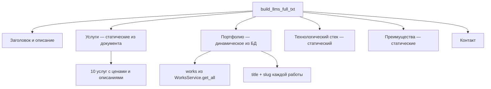

# План: AI-Friendly SEO — Реализация llms.txt на бэкенде

> На основе документа `temp/Quiz/08-AI-FRIENDLY-SEO.md`
> Файл для изменения: `src/business/Seo/seoRouter.py`

---

## Обзор

Все изменения集中在 одном файле [`seoRouter.py`](src/business/Seo/seoRouter.py), который уже обслуживает `robots.txt` и `sitemap.xml`. Никакие другие файлы менять не нужно — роутер уже зарегистрирован в [`main.py`](main.py:48).

---

## Архитектура изменений

```mermaid
graph TD
    A[src/business/Seo/seoRouter.py] --> B[/robots.txt — обновить]
    A --> C[/sitemap.xml — добавить llms URL]
    A --> D[/llms.txt — НОВЫЙ эндпоинт]
    A --> E[/llms-full.txt — НОВЫЙ эндпоинт]
    A --> F[/ai.txt — НОВЫЙ эндпоинт]

    D --> G[PlainTextResponse]
    E --> H[PlainTextResponse — динамический из БД]
    F --> I[PlainTextResponse — алиас llms.txt]

    H --> J[WorksService.get_all]
    H --> K[CategoryService.get_all]
```

---

## Шаг 1: Обновить robots.txt

**Что изменить:** Добавить в функцию [`get_robots()`](src/business/Seo/seoRouter.py:19) разрешения для AI-ботов и файлов llms.txt.

**Добавить в содержимое robots.txt:**

```
# AI-системы
Allow: /llms.txt
Allow: /llms-full.txt

User-agent: GPTBot
Allow: /

User-agent: ChatGPT-User
Allow: /

User-agent: Claude-Web
Allow: /

User-agent: PerplexityBot
Allow: /

User-agent: Google-Extended
Allow: /
```

**Итоговый robots.txt** будет содержать существующие правила + новые AI-правила.

---

## Шаг 2: Добавить эндпоинт /llms.txt

**Тип:** Статический контент (по аналогии с robots.txt)

**Реализация:**
- Определить константу `LLMS_TXT_CONTENT` с содержимым из документа (секция 2)
- URL-ы внутри использовать через `BASE_URL` для консистентности с остальным кодом
- Эндпоинт `GET /llms.txt`
- Response: `PlainTextResponse` с `media_type="text/plain; charset=utf-8"`
- Headers: `Cache-Control: public, max-age=86400` (24 часа), `X-Robots-Tag: index, follow`

---

## Шаг 3: Добавить эндпоинт /llms-full.txt

**Тип:** Динамический контент (данные из БД)

**Реализация:**
- Вынести построение контента в отдельную async-функцию `build_llms_full_txt()`
- Функция принимает данные от `WorksService.get_all()` и `CategoryService.get_all()` (как в sitemap)
- Формирует Markdown-контент по структуре из документа (секция 3):
  - Заголовок и описание
  - Услуги с описаниями и ценами (из документа — статические данные)
  - Портфолио из БД (works)
  - Технологический стек
  - Уникальные преимущества
  - Контакт
- Эндпоинт `GET /llms-full.txt`
- Response: `PlainTextResponse` с `media_type="text/plain; charset=utf-8"`
- Headers: `Cache-Control: public, max-age=3600` (1 час — т.к. динамический), `X-Robots-Tag: index, follow`

**Структура данных в llms-full.txt:**



---

## Шаг 4: Добавить эндпоинт /ai.txt

**Тип:** Альтернативный стандарт (алиас llms.txt)

**Реализация:**
- Использовать ту же константу `LLMS_TXT_CONTENT`
- Эндпоинт `GET /ai.txt`
- Response: `PlainTextResponse` с `media_type="text/plain; charset=utf-8"`
- Без кеширования (простой алиас)

---

## Шаг 5: Обновить sitemap.xml

**Что изменить:** В функции [`get_sitemap()`](src/business/Seo/seoRouter.py:43) добавить URL-ы llms.txt и llms-full.txt в массив `static_urls`.

**Добавить:**
```python
{'loc': f'{BASE_URL}/llms.txt', 'changefreq': 'weekly', 'priority': '0.5'},
{'loc': f'{BASE_URL}/llms-full.txt', 'changefreq': 'weekly', 'priority': '0.5'},
```

---

## Итоговая структура seoRouter.py

```
seoRouter.py
├── Импорты (добавить PlainTextResponse)
├── seoRouter = APIRouter(tags=['SEO'])
├── LLMS_TXT_CONTENT = "..."              # НОВАЯ константа
├── get_robots()                          # ОБНОВЛЁН — AI-боты
├── get_sitemap()                         # ОБНОВЛЁН — llms URL
├── build_llms_full_txt(works) -> str     # НОВАЯ функция
├── llms_txt()                            # НОВЫЙ эндпоинт GET /llms.txt
├── llms_full_txt()                       # НОВЫЙ эндпоинт GET /llms-full.txt
└── ai_txt()                              # НОВЫЙ эндпоинт GET /ai.txt
```

---

## Статус изменений в документе 08-AI-FRIENDLY-SEO.md

| Пункт документа | Затрагивает бэкенд? | Реализуется в этой задаче? |
|---|---|---|
| 2. /llms.txt | ✅ Да | ✅ Да |
| 3. /llms-full.txt | ✅ Да | ✅ Да |
| 4. Техническая реализация FastAPI | ✅ Да | ✅ Да |
| 5. Schema.org | ❌ Фронтенд | ❌ Нет |
| 6. Мета-теги | ❌ Фронтенд | ❌ Нет |
| 7. Обновление robots.txt | ✅ Да | ✅ Да |
| 9.2. ai.txt | ✅ Да | ✅ Да |

---

## Чеклист после реализации

- [ ] `/robots.txt` отвечает 200 OK с AI-правилами
- [ ] `/llms.txt` отвечает 200 OK, Content-Type: `text/plain; charset=utf-8`
- [ ] `/llms-full.txt` отвечает 200 OK с динамическим контентом
- [ ] `/ai.txt` отвечает 200 OK (алиас llms.txt)
- [ ] `/sitemap.xml` содержит URL-ы llms.txt и llms-full.txt
- [ ] Все ссылки в llms.txt ведут на существующие страницы
- [ ] Нет ошибок импорта, сервер запускается без ошибок
