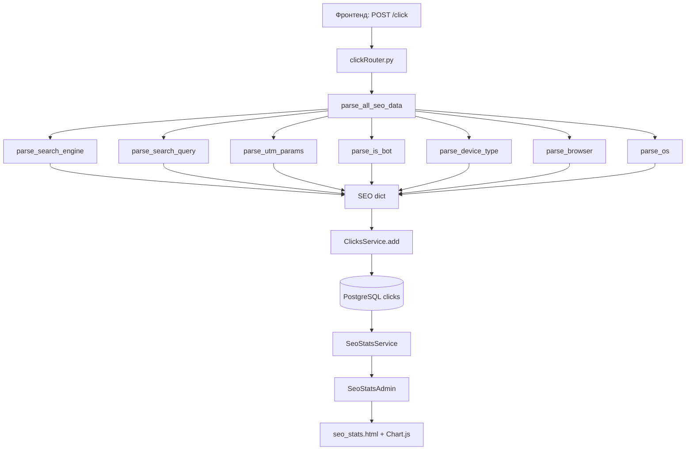

# ТЗ: SEO-статистика кликов — расширение модели Clicks + админ-дашборд

## Обзор

Расширяем существующий эндпоинт `POST /click` для сбора SEO-данных из поисковых систем, UTM-меток и User-Agent. Добавляем кастомную страницу в админке (sqladmin `BaseView`) с дашбордом SEO-статистики и графиками на Chart.js.

**Ключевой принцип:** базовый клик сохраняется ВСЕГДА, даже если парсинг SEO-данных не удался. Парсинг — это «украшение» над надёжным ядром.

---

## 1. Расширение модели Clicks

### Файл: `src/business/Click/click_table.py`

Добавить новые колонки к существующей модели:

```python
from sqlalchemy import Integer, Column, String, DateTime, Boolean
from datetime import datetime
from settings import Base


class Clicks(Base):
    __tablename__ = 'clicks'

    # --- Существующие поля (НЕ ТРОГАТЬ) ---
    id = Column(Integer, primary_key=True, nullable=False)
    url = Column(String, nullable=False)
    useragent = Column(String, nullable=True)
    referer = Column(String, nullable=True)
    ip = Column(String, nullable=True)
    date = Column(DateTime, nullable=True, default=datetime.utcnow)

    # --- UTM-метки ---
    utm_source = Column(String(255), nullable=True)       # уже передаётся из фронтенда
    utm_medium = Column(String(255), nullable=True)        # cpc, organic, social, email
    utm_campaign = Column(String(255), nullable=True)      # название кампании
    utm_term = Column(String(255), nullable=True)          # ключевое слово (для CPC)
    utm_content = Column(String(255), nullable=True)       # вариант объявления

    # --- SEO: поисковые системы ---
    search_engine = Column(String(100), nullable=True)     # google, yandex, bing, duckduckgo, other
    search_query = Column(String(1000), nullable=True)     # поисковый запрос из referer

    # --- User-Agent парсинг ---
    is_bot = Column(Boolean, nullable=True, default=False)  # является ли ботом
    device_type = Column(String(50), nullable=True)         # desktop, mobile, tablet, unknown
    browser = Column(String(100), nullable=True)            # Chrome, Firefox, Safari, Yandex и т.д.
    os = Column(String(100), nullable=True)                 # Windows, macOS, Android, iOS и т.д.

    # --- Геолокация (опционально, на будущее) ---
    country = Column(String(100), nullable=True)
    city = Column(String(100), nullable=True)
```

### Важные замечания по модели

- `utm_source` — уже передаётся из фронтенда через `data.utm_source`. Теперь сохраняем его в БД (ранее использовался только для Telegram-уведомлений).
- Все новые поля `nullable=True` — обеспечивает обратную совместимость и отказоустойчивость.
- `String(255)` вместо `String` для индексируемых полей — оптимальнее для PostgreSQL.
- `search_query` — `String(1000)` т.к. запросы могут быть длинными.
- `is_bot` — `Boolean` с `default=False`.
- `country`/`city` — заготовка на будущее, пока не заполняется.

---

## 2. Модуль парсинга SEO-данных

### Файл: `src/business/Click/seo_parser.py` (НОВЫЙ)

Отдельный модуль для парсинга. Все функции — чистые, синхронные, без side-effects. Каждая функция обёрнута в try/except с fallback-значением.

```python
"""
Парсинг SEO-данных из referer и User-Agent.

Все функции безопасны: при ошибке возвращают значение по умолчанию,
никогда не бросают исключения наружу.
"""
import logging
from urllib.parse import urlparse, parse_qs
from typing import Optional

logger = logging.getLogger(__name__)


# ============================================================
# Парсер поисковых систем из referer
# ============================================================

# Маппинг: домен → (название поисковика, параметр запроса)
SEARCH_ENGINES = {
    'google.':     ('google', 'q'),
    'yandex.':     ('yandex', 'text'),
    'bing.com':    ('bing', 'q'),
    'duckduckgo.': ('duckduckgo', 'q'),
    'yahoo.com':   ('yahoo', 'p'),
    'mail.ru':     ('mailru', 'q'),
    'rambler.ru':  ('rambler', 'query'),
    'go.mail.ru':  ('mailru', 'q'),
    'nova.rambler.ru': ('rambler', 'query'),
}


def parse_search_engine(referer: str) -> Optional[str]:
    """
    Определяет поисковую систему из referer.

    Возвращает: 'google', 'yandex', 'bing', 'duckduckgo', 'yahoo', 'mailru', 'rambler' или None.
    """
    if not referer:
        return None

    try:
        referer_lower = referer.lower()
        for domain_part, (engine_name, _) in SEARCH_ENGINES.items():
            if domain_part in referer_lower:
                return engine_name
        return None
    except Exception as e:
        logger.debug(f"parse_search_engine error: {e}")
        return None


def parse_search_query(referer: str) -> Optional[str]:
    """
    Извлекает поисковый запрос из referer.

    Логика:
    1. Определяем поисковик по домену referer
    2. Парсим query-string URL referer
    3. Извлекаем параметр запроса для данного поисковика
    4. Возвращаем первый непустой результат

    Примеры referer:
    - https://www.google.com/search?q=python+portfolio&hl=ru  → 'python portfolio'
    - https://yandex.ru/search/?text=создать+сайт             → 'создать сайт'
    - https://www.bing.com/search?q=fastapi+tutorial          → 'fastapi tutorial'
    """
    if not referer:
        return None

    try:
        referer_lower = referer.lower()
        parsed = urlparse(referer)
        query_params = parse_qs(parsed.query)

        for domain_part, (engine_name, param_name) in SEARCH_ENGINES.items():
            if domain_part in referer_lower:
                values = query_params.get(param_name, [])
                if values and values[0].strip():
                    return values[0].strip()

        return None
    except Exception as e:
        logger.debug(f"parse_search_query error: {e}")
        return None


def parse_utm_params(referer: Optional[str], url: Optional[str]) -> dict:
    """
    Извлекает UTM-параметры из URL страницы (url) и referer.

    UTM-метки обычно находятся в URL страницы (url параметр),
    а не в referer. Парсим оба источника, url имеет приоритет.

    Возвращает dict с ключами:
    - utm_source, utm_medium, utm_campaign, utm_term, utm_content
    """
    result = {
        'utm_source': None,
        'utm_medium': None,
        'utm_campaign': None,
        'utm_term': None,
        'utm_content': None,
    }

    try:
        # Парсим UTM из URL страницы (основной источник)
        if url:
            parsed = urlparse(url)
            params = parse_qs(parsed.query)
            for key in result:
                values = params.get(key, [])
                if values and values[0].strip():
                    result[key] = values[0].strip()

        # Если utm_source не найден в URL, пробуем referer
        if not result['utm_source'] and referer:
            parsed_ref = urlparse(referer)
            params_ref = parse_qs(parsed_ref.query)
            for key in result:
                if not result[key]:
                    values = params_ref.get(key, [])
                    if values and values[0].strip():
                        result[key] = values[0].strip()

        return result
    except Exception as e:
        logger.debug(f"parse_utm_params error: {e}")
        return result


# ============================================================
# Парсер User-Agent
# ============================================================

# Список известных ботов (подстроки в user-agent, нижний регистр)
BOT_PATTERNS = [
    'bot', 'crawler', 'spider', 'slurp', 'mediapartners',
    'googlebot', 'yandexbot', 'bingbot', 'baiduspider',
    'duckduckbot', 'facebot', 'ia_archiver', 'semrushbot',
    'ahrefsbot', 'mj12bot', 'dotbot', 'petalbot',
    'bytespider', 'gptbot', 'chatgpt-user', 'claudebot',
    'ccbot', 'applebot', 'sogou', 'exabot',
]

# Маппинг: подстрока в user-agent → (браузер, приоритет)
# Приоритет нужен, т.к. Chrome содержит "Safari", а Edge содержит "Chrome"
BROWSER_PATTERNS = [
    ('edg/', 'Edge'),
    ('opr/', 'Opera'),
    ('opera', 'Opera'),
    ('firefox', 'Firefox'),
    ('fxios', 'Firefox'),
    ('chrome', 'Chrome'),
    ('crios', 'Chrome'),
    ('safari', 'Safari'),
    ('yabrowser', 'Yandex Browser'),
    ('yabrowser/', 'Yandex Browser'),
    ('yaapp', 'Yandex App'),
    ('miuibrowser', 'MIUI Browser'),
    ('samsungbrowser', 'Samsung Browser'),
    ('ucbrowser', 'UC Browser'),
    ('vivaldi', 'Vivaldi'),
    ('brave', 'Brave'),
    ('seamonkey', 'SeaMonkey'),
]

# Маппинг: подстрока в user-agent → ОС
OS_PATTERNS = [
    ('windows nt 10', 'Windows 10'),
    ('windows nt 6.3', 'Windows 8.1'),
    ('windows nt 6.2', 'Windows 8'),
    ('windows nt 6.1', 'Windows 7'),
    ('windows nt 6.0', 'Windows Vista'),
    ('windows', 'Windows'),
    ('mac os x', 'macOS'),
    ('macintosh', 'macOS'),
    ('iphone', 'iOS'),
    ('ipad', 'iOS'),
    ('ipod', 'iOS'),
    ('android', 'Android'),
    ('linux', 'Linux'),
    ('cros', 'Chrome OS'),
    ('CrOS', 'Chrome OS'),
]

# Паттерны для определения типа устройства
MOBILE_PATTERNS = ['mobile', 'android', 'iphone', 'ipod', 'windows phone', 'blackberry', 'opera mini', 'opera mobi']
TABLET_PATTERNS = ['ipad', 'tablet', 'kindle', 'silk', 'gt-p', 'sm-t']


def parse_is_bot(user_agent: str) -> bool:
    """
    Определяет, является ли User-Agent ботом.

    Возвращает True если обнаружен известный бот, иначе False.
    """
    if not user_agent:
        return False

    try:
        ua_lower = user_agent.lower()
        return any(bot in ua_lower for bot in BOT_PATTERNS)
    except Exception as e:
        logger.debug(f"parse_is_bot error: {e}")
        return False


def parse_device_type(user_agent: str) -> str:
    """
    Определяет тип устройства из User-Agent.

    Возвращает: 'mobile', 'tablet', 'desktop' или 'unknown'.
    Логика: сначала проверяем tablet (т.к. iPad содержит 'Safari'),
    потом mobile, остальное — desktop.
    """
    if not user_agent:
        return 'unknown'

    try:
        ua_lower = user_agent.lower()

        # Tablet проверяем раньше mobile, т.к. iPad может содержать 'mobile'
        if any(p in ua_lower for p in TABLET_PATTERNS):
            return 'tablet'

        if any(p in ua_lower for p in MOBILE_PATTERNS):
            return 'mobile'

        # Если есть desktop-индикаторы или ничего не совпало
        return 'desktop'
    except Exception as e:
        logger.debug(f"parse_device_type error: {e}")
        return 'unknown'


def parse_browser(user_agent: str) -> str:
    """
    Определяет браузер из User-Agent.

    Возвращает название браузера или 'Unknown'.

    Порядок важен: Edge/Opera проверяются раньше Chrome,
    т.к. они содержат 'Chrome' в UA-строке.
    """
    if not user_agent:
        return 'Unknown'

    try:
        ua_lower = user_agent.lower()
        for pattern, browser_name in BROWSER_PATTERNS:
            if pattern in ua_lower:
                return browser_name
        return 'Unknown'
    except Exception as e:
        logger.debug(f"parse_browser error: {e}")
        return 'Unknown'


def parse_os(user_agent: str) -> str:
    """
    Определяет операционную систему из User-Agent.

    Возвращает название ОС или 'Unknown'.
    """
    if not user_agent:
        return 'Unknown'

    try:
        ua_lower = user_agent.lower()
        for pattern, os_name in OS_PATTERNS:
            if pattern in ua_lower:
                return os_name
        return 'Unknown'
    except Exception as e:
        logger.debug(f"parse_os error: {e}")
        return 'Unknown'


# ============================================================
# Главная функция: собрать все SEO-данные разом
# ============================================================

def parse_all_seo_data(
    referer: Optional[str] = None,
    user_agent: Optional[str] = None,
    url: Optional[str] = None,
) -> dict:
    """
    Собирает все SEO-данные из referer, user-agent и URL.

    Безопасная функция: при любой ошибке возвращает dict с fallback-значениями.
    Никогда не бросает исключения.

    Параметры:
    - referer: заголовок Referer из запроса
    - user_agent: заголовок User-Agent из запроса
    - url: URL страницы, на которую кликнули (из body запроса)

    Возвращает dict:
    {
        'utm_source': str | None,
        'utm_medium': str | None,
        'utm_campaign': str | None,
        'utm_term': str | None,
        'utm_content': str | None,
        'search_engine': str | None,
        'search_query': str | None,
        'is_bot': bool,
        'device_type': str,
        'browser': str,
        'os': str,
    }
    """
    try:
        # UTM-метки
        utm = parse_utm_params(referer, url)

        # Поисковая система и запрос
        search_engine = parse_search_engine(referer)
        search_query = parse_search_query(referer)

        # User-Agent
        is_bot = parse_is_bot(user_agent)
        device_type = parse_device_type(user_agent)
        browser = parse_browser(user_agent)
        os_name = parse_os(user_agent)

        return {
            'utm_source': utm.get('utm_source'),
            'utm_medium': utm.get('utm_medium'),
            'utm_campaign': utm.get('utm_campaign'),
            'utm_term': utm.get('utm_term'),
            'utm_content': utm.get('utm_content'),
            'search_engine': search_engine,
            'search_query': search_query,
            'is_bot': is_bot,
            'device_type': device_type,
            'browser': browser,
            'os': os_name,
        }
    except Exception as e:
        logger.error(f"parse_all_seo_data critical error: {e}")
        # Полный fallback — возвращаем пустые значения
        return {
            'utm_source': None,
            'utm_medium': None,
            'utm_campaign': None,
            'utm_term': None,
            'utm_content': None,
            'search_engine': None,
            'search_query': None,
            'is_bot': False,
            'device_type': 'unknown',
            'browser': 'Unknown',
            'os': 'Unknown',
        }
```

### Почему свой парсер, а не библиотека

- **user-agents** (pip) — тяжёлая библиотека с регулярками, не сильно точнее простого маппинга.
- **python-user-agents** — устаревший, проблемы с поддержкой новых браузеров.
- Свой парсер — 0 зависимостей, полный контроль, легко добавлять новые боты/браузеры.
- Для парсинга URL используется стандартная `urllib.parse` — без дополнительных зависимостей.

---

## 3. Изменение роутера

### Файл: `src/business/Click/clickRouter.py`

#### 3.1. Расширение Pydantic-модели

```python
class ClickProps(BaseModel):
    url: Optional[str] = None
    utm_source: Optional[str] = None
    utm_medium: Optional[str] = None
    utm_campaign: Optional[str] = None
    utm_term: Optional[str] = None
    utm_content: Optional[str] = None
    attribution: Optional[AttributionModel] = None
```

> **Примечание:** UTM-метки могут приходить как из body запроса (фронтенд), так и из URL страницы (url параметр). Фронтенд имеет приоритет — если фронтенд передал utm_source, берём его, а не парсим из URL.

#### 3.2. Обновлённая логика эндпоинта

```python
from src.business.Click.seo_parser import parse_all_seo_data


@clickRouter.post('')
async def send_order(request: Request, data: ClickProps):
    # --- Определяем IP и User-Agent ---
    user_agent = request.headers.get("user-agent", "")
    referer = request.headers.get("referer", "")

    url = data.url or ""

    if '#' in url:
        url = url.replace('#', '_')

    try:
        ip_address = f'{request.client.host}:{request.client.port}'
    except Exception:
        ip_address = '-'

    # --- Парсим SEO-данные (БЕЗОПАСНО — никогда не падает) ---
    seo_data = parse_all_seo_data(
        referer=referer,
        user_agent=user_agent,
        url=url,
    )

    # --- Фронтендовые UTM имеют приоритет над парсингом из URL ---
    if data.utm_source:
        seo_data['utm_source'] = data.utm_source
    if data.utm_medium:
        seo_data['utm_medium'] = data.utm_medium
    if data.utm_campaign:
        seo_data['utm_campaign'] = data.utm_campaign
    if data.utm_term:
        seo_data['utm_term'] = data.utm_term
    if data.utm_content:
        seo_data['utm_content'] = data.utm_content

    # --- Сохраняем клик в БД (КРИТИЧНО — не в try/except) ---
    await ClicksService.add(
        url=url,
        useragent=user_agent,
        referer=referer,
        ip=ip_address,
        # UTM
        utm_source=seo_data['utm_source'],
        utm_medium=seo_data['utm_medium'],
        utm_campaign=seo_data['utm_campaign'],
        utm_term=seo_data['utm_term'],
        utm_content=seo_data['utm_content'],
        # SEO
        search_engine=seo_data['search_engine'],
        search_query=seo_data['search_query'],
        # User-Agent
        is_bot=seo_data['is_bot'],
        device_type=seo_data['device_type'],
        browser=seo_data['browser'],
        os=seo_data['os'],
    )

    # --- Telegram-уведомление (НЕКРИТИЧНО) ---
    # ... существующая логика без изменений ...
    # При желании можно добавить seo_data в Telegram-сообщение

    return {'status': 'ok'}
```

### Ключевые принципы

1. `parse_all_seo_data()` — **всегда** возвращает dict, никогда не бросает исключения.
2. `ClicksService.add()` — обёрнут в try/except внутри `BaseService.add`, логирует ошибки.
3. Фронтендовые UTM-метки перезаписывают парсинг — приоритет пользователя.
4. `is_bot` определяется автоматически из user-agent (не нужно передавать с фронтенда).
5. Telegram-уведомление не зависит от SEO-парсинга.

---

## 4. Отказоустойчивость

### Принцип «трёх уровней защиты»

```
┌─────────────────────────────────────────────────────────────┐
│  Уровень 1: seo_parser.py                                   │
│  Каждая функция обёрнута в try/except → fallback значение   │
├─────────────────────────────────────────────────────────────┤
│  Уровень 2: parse_all_seo_data()                            │
│  Общий try/except → полный fallback dict                    │
├─────────────────────────────────────────────────────────────┤
│  Уровень 3: BaseService.add()                               │
│  try/except + logger_msg → клик сохраняется или логируется  │
└─────────────────────────────────────────────────────────────┘
```

### Fallback-значения

| Поле | Fallback при ошибке |
|------|-------------------|
| `utm_source` | `None` (NULL в БД) |
| `utm_medium` | `None` |
| `utm_campaign` | `None` |
| `utm_term` | `None` |
| `utm_content` | `None` |
| `search_engine` | `None` |
| `search_query` | `None` |
| `is_bot` | `False` |
| `device_type` | `'unknown'` |
| `browser` | `'Unknown'` |
| `os` | `'Unknown'` |

### Правило

> Базовый клик (url, useragent, referer, ip, date) сохраняется ВСЕГДА.
> SEO-данные — бонус. Если парсинг не удался, клик всё равно записан.

---

## 5. Кастомная админ-страница SEO-статистики

### 5.1. Архитектура

```
┌──────────────┐     ┌──────────────────┐     ┌─────────────────────┐
│  Admin View  │────▶│  SeoStatsService │────▶│  PostgreSQL clicks  │
│  (BaseView)  │     │  (SQL-запросы)   │     │  таблица            │
└──────┬───────┘     └──────────────────┘     └─────────────────────┘
       │
       ▼
┌──────────────────┐
│  HTML Template   │
│  + Chart.js      │
└──────────────────┘
```

### 5.2. Сервис статистики

#### Файл: `src/business/Click/SeoStatsService.py` (НОВЫЙ)

```python
"""
Сервис для агрегации SEO-статистики из таблицы clicks.
Все методы принимают AsyncSession и возвращают dict/list.
"""
import logging
from datetime import datetime, timedelta
from typing import Optional

from sqlalchemy import select, func, and_, case, text
from sqlalchemy.ext.asyncio import AsyncSession

from src.business.Click.click_table import Clicks

logger = logging.getLogger(__name__)


class SeoStatsService:

    @staticmethod
    async def get_summary(session: AsyncSession, days: int = 30) -> dict:
        """
        Общая сводка за период.
        """
        since = datetime.utcnow() - timedelta(days=days)

        # Всего кликов
        total_q = select(func.count(Clicks.id)).where(Clicks.date >= since)
        total = (await session.execute(total_q)).scalar() or 0

        # Уникальные IP
        unique_ip_q = select(func.count(func.distinct(Clicks.ip))).where(Clicks.date >= since)
        unique_ip = (await session.execute(unique_ip_q)).scalar() or 0

        # Клики из поиска
        search_q = select(func.count(Clicks.id)).where(
            and_(Clicks.date >= since, Clicks.search_engine.isnot(None))
        )
        search_clicks = (await session.execute(search_q)).scalar() or 0

        # Боты
        bots_q = select(func.count(Clicks.id)).where(
            and_(Clicks.date >= since, Clicks.is_bot == True)
        )
        bots = (await session.execute(bots_q)).scalar() or 0

        # Человеческие клики
        human = total - bots

        return {
            'total_clicks': total,
            'unique_ips': unique_ip,
            'search_clicks': search_clicks,
            'search_share': round(search_clicks / total * 100, 1) if total > 0 else 0,
            'bot_clicks': bots,
            'human_clicks': human,
        }

    @staticmethod
    async def get_clicks_by_day(session: AsyncSession, days: int = 30) -> list:
        """
        Клики по дням (для графика).

        Возвращает: [{'date': '2026-08-01', 'count': 42}, ...]
        """
        since = datetime.utcnow() - timedelta(days=days)

        q = (
            select(
                func.date(Clicks.date).label('date'),
                func.count(Clicks.id).label('count'),
            )
            .where(Clicks.date >= since)
            .group_by(func.date(Clicks.date))
            .order_by(func.date(Clicks.date))
        )

        result = await session.execute(q)
        return [{'date': str(row.date), 'count': row.count} for row in result.all()]

    @staticmethod
    async def get_search_engines_breakdown(session: AsyncSession, days: int = 30) -> list:
        """
        Распределение по поисковым системам.

        Возвращает: [{'engine': 'google', 'count': 150, 'share': 60.5}, ...]
        """
        since = datetime.utcnow() - timedelta(days=days)

        q = (
            select(
                Clicks.search_engine.label('engine'),
                func.count(Clicks.id).label('count'),
            )
            .where(and_(Clicks.date >= since, Clicks.search_engine.isnot(None)))
            .group_by(Clicks.search_engine)
            .order_by(func.count(Clicks.id).desc())
        )

        result = await session.execute(q)
        rows = result.all()
        total = sum(r.count for r in rows) or 1

        return [
            {
                'engine': row.engine or 'unknown',
                'count': row.count,
                'share': round(row.count / total * 100, 1),
            }
            for row in rows
        ]

    @staticmethod
    async def get_top_search_queries(session: AsyncSession, days: int = 30, limit: int = 20) -> list:
        """
        Топ поисковых запросов.

        Возвращает: [{'query': 'создать сайт', 'count': 15, 'engine': 'yandex'}, ...]
        """
        since = datetime.utcnow() - timedelta(days=days)

        q = (
            select(
                Clicks.search_query.label('query'),
                Clicks.search_engine.label('engine'),
                func.count(Clicks.id).label('count'),
            )
            .where(and_(
                Clicks.date >= since,
                Clicks.search_query.isnot(None),
                Clicks.search_query != '',
            ))
            .group_by(Clicks.search_query, Clicks.search_engine)
            .order_by(func.count(Clicks.id).desc())
            .limit(limit)
        )

        result = await session.execute(q)
        return [
            {'query': row.query, 'engine': row.engine, 'count': row.count}
            for row in result.all()
        ]

    @staticmethod
    async def get_top_pages_from_search(session: AsyncSession, days: int = 30, limit: int = 20) -> list:
        """
        Топ страниц по кликам из поиска.

        Возвращает: [{'url': '/works/my-project', 'count': 30}, ...]
        """
        since = datetime.utcnow() - timedelta(days=days)

        q = (
            select(
                Clicks.url.label('url'),
                func.count(Clicks.id).label('count'),
            )
            .where(and_(Clicks.date >= since, Clicks.search_engine.isnot(None)))
            .group_by(Clicks.url)
            .order_by(func.count(Clicks.id).desc())
            .limit(limit)
        )

        result = await session.execute(q)
        return [{'url': row.url, 'count': row.count} for row in result.all()]

    @staticmethod
    async def get_utm_analysis(session: AsyncSession, days: int = 30) -> dict:
        """
        UTM-анализ: источники и кампании.

        Возвращает:
        {
            'sources': [{'source': 'google', 'count': 100}, ...],
            'campaigns': [{'campaign': 'summer_sale', 'count': 50}, ...],
            'mediums': [{'medium': 'cpc', 'count': 80}, ...],
        }
        """
        since = datetime.utcnow() - timedelta(days=days)

        # UTM Sources
        sources_q = (
            select(Clicks.utm_source.label('source'), func.count(Clicks.id).label('count'))
            .where(and_(Clicks.date >= since, Clicks.utm_source.isnot(None), Clicks.utm_source != ''))
            .group_by(Clicks.utm_source)
            .order_by(func.count(Clicks.id).desc())
            .limit(15)
        )
        sources = (await session.execute(sources_q)).all()

        # UTM Campaigns
        campaigns_q = (
            select(Clicks.utm_campaign.label('campaign'), func.count(Clicks.id).label('count'))
            .where(and_(Clicks.date >= since, Clicks.utm_campaign.isnot(None), Clicks.utm_campaign != ''))
            .group_by(Clicks.utm_campaign)
            .order_by(func.count(Clicks.id).desc())
            .limit(15)
        )
        campaigns = (await session.execute(campaigns_q)).all()

        # UTM Mediums
        mediums_q = (
            select(Clicks.utm_medium.label('medium'), func.count(Clicks.id).label('count'))
            .where(and_(Clicks.date >= since, Clicks.utm_medium.isnot(None), Clicks.utm_medium != ''))
            .group_by(Clicks.utm_medium)
            .order_by(func.count(Clicks.id).desc())
            .limit(15)
        )
        mediums = (await session.execute(mediums_q)).all()

        return {
            'sources': [{'source': r.source, 'count': r.count} for r in sources],
            'campaigns': [{'campaign': r.campaign, 'count': r.count} for r in campaigns],
            'mediums': [{'medium': r.medium, 'count': r.count} for r in mediums],
        }

    @staticmethod
    async def get_device_breakdown(session: AsyncSession, days: int = 30) -> list:
        """
        Распределение по типам устройств.

        Возвращает: [{'device': 'desktop', 'count': 200}, ...]
        """
        since = datetime.utcnow() - timedelta(days=days)

        q = (
            select(Clicks.device_type.label('device'), func.count(Clicks.id).label('count'))
            .where(Clicks.date >= since)
            .group_by(Clicks.device_type)
            .order_by(func.count(Clicks.id).desc())
        )

        result = await session.execute(q)
        return [{'device': row.device or 'unknown', 'count': row.count} for row in result.all()]

    @staticmethod
    async def get_browser_breakdown(session: AsyncSession, days: int = 30) -> list:
        """
        Распределение по браузерам.
        """
        since = datetime.utcnow() - timedelta(days=days)

        q = (
            select(Clicks.browser.label('browser'), func.count(Clicks.id).label('count'))
            .where(Clicks.date >= since)
            .group_by(Clicks.browser)
            .order_by(func.count(Clicks.id).desc())
            .limit(10)
        )

        result = await session.execute(q)
        return [{'browser': row.browser or 'Unknown', 'count': row.count} for row in result.all()]

    @staticmethod
    async def get_os_breakdown(session: AsyncSession, days: int = 30) -> list:
        """
        Распределение по ОС.
        """
        since = datetime.utcnow() - timedelta(days=days)

        q = (
            select(Clicks.os.label('os'), func.count(Clicks.id).label('count'))
            .where(Clicks.date >= since)
            .group_by(Clicks.os)
            .order_by(func.count(Clicks.id).desc())
            .limit(10)
        )

        result = await session.execute(q)
        return [{'os': row.os or 'Unknown', 'count': row.count} for row in result.all()]
```

### 5.3. Admin View

#### Файл: `src/business/Click/seoStatsAdmin.py` (НОВЫЙ)

```python
"""
Кастомная страница SEO-статистики в админке sqladmin.
Использует BaseView + @expose для страницы без модели.
"""
import logging

from fastapi import Request
from sqladmin import BaseView, expose

from src.sql.bd import async_session_maker
from src.business.Click.SeoStatsService import SeoStatsService

logger = logging.getLogger(__name__)


class SeoStatsAdmin(BaseView):
    name = "SEO Статистика"
    icon = "fa-solid fa-chart-line"

    @expose("/seo-stats", methods=["GET"])
    async def seo_stats_page(self, request: Request):
        # Получаем параметр days из query string (по умолчанию 30)
        try:
            days = int(request.query_params.get('days', 30))
            if days not in (7, 30, 90, 180, 365):
                days = 30
        except (ValueError, TypeError):
            days = 30

        try:
            async with async_session_maker() as session:
                stats = {
                    'summary': await SeoStatsService.get_summary(session, days=days),
                    'clicks_by_day': await SeoStatsService.get_clicks_by_day(session, days=days),
                    'search_engines': await SeoStatsService.get_search_engines_breakdown(session, days=days),
                    'top_queries': await SeoStatsService.get_top_search_queries(session, days=days),
                    'top_pages': await SeoStatsService.get_top_pages_from_search(session, days=days),
                    'utm': await SeoStatsService.get_utm_analysis(session, days=days),
                    'devices': await SeoStatsService.get_device_breakdown(session, days=days),
                    'browsers': await SeoStatsService.get_browser_breakdown(session, days=days),
                    'oses': await SeoStatsService.get_os_breakdown(session, days=days),
                }
        except Exception as e:
            logger.error(f"SeoStatsAdmin error: {e}", exc_info=True)
            stats = {'error': str(e)}

        return await self.templates.TemplateResponse(
            request,
            "sqladmin/seo_stats.html",
            {
                "request": request,
                "stats": stats,
                "days": days,
            },
        )
```

### 5.4. HTML-шаблон

#### Файл: `templates/sqladmin/seo_stats.html` (НОВЫЙ)

```html



    {{ super() }}
    <style>
        .seo-stats-container { padding: 20px; }
        .stat-card {
            border-left: 4px solid #4e73df;
            background: #fff;
            border-radius: 8px;
            padding: 20px;
            margin-bottom: 20px;
            box-shadow: 0 2px 4px rgba(0,0,0,0.08);
        }
        .stat-card.success { border-left-color: #1cc88a; }
        .stat-card.warning { border-left-color: #f6c23e; }
        .stat-card.danger { border-left-color: #e74a3b; }
        .stat-card.info { border-left-color: #36b9cc; }
        .stat-label { font-size: 0.8rem; color: #858796; text-transform: uppercase; letter-spacing: 0.05em; }
        .stat-value { font-size: 1.8rem; font-weight: 700; color: #5a5c69; }
        .chart-container { background: #fff; border-radius: 8px; padding: 20px; margin-bottom: 20px; box-shadow: 0 2px 4px rgba(0,0,0,0.08); }
        .chart-title { font-size: 1.1rem; font-weight: 600; color: #5a5c69; margin-bottom: 15px; }
        .data-table { width: 100%; border-collapse: collapse; }
        .data-table th, .data-table td { padding: 10px 12px; text-align: left; border-bottom: 1px solid #e3e6f0; }
        .data-table th { background: #f8f9fc; color: #858796; font-size: 0.8rem; text-transform: uppercase; }
        .data-table tr:hover { background: #f8f9fc; }
        .filter-bar { margin-bottom: 20px; display: flex; gap: 10px; align-items: center; }
        .filter-btn {
            padding: 6px 16px; border: 1px solid #d1d3e2; border-radius: 4px;
            background: #fff; color: #5a5c69; cursor: pointer; font-size: 0.9rem;
            text-decoration: none;
        }
        .filter-btn:hover { background: #f8f9fc; }
        .filter-btn.active { background: #4e73df; color: #fff; border-color: #4e73df; }
        .badge-engine { padding: 2px 8px; border-radius: 12px; font-size: 0.75rem; color: #fff; }
        .badge-google { background: #4285f4; }
        .badge-yandex { background: #fc3f1d; }
        .badge-bing { background: #00809d; }
        .badge-duckduckgo { background: #de5833; }
        .badge-other { background: #858796; }
    </style>



<div class="seo-stats-container">
    <div class="d-flex justify-content-between align-items-center mb-4">
        <h1 class="h3 text-gray-800">
            <i class="fa-solid fa-chart-line"></i> SEO Статистика
        </h1>
        <div class="filter-bar">
            <span class="text-muted">Период:</span>
            <a href="?days=7" class="filter-btn active">7 дней</a>
            <a href="?days=30" class="filter-btn active">30 дней</a>
            <a href="?days=90" class="filter-btn active">90 дней</a>
            <a href="?days=180" class="filter-btn active">180 дней</a>
            <a href="?days=365" class="filter-btn active">Год</a>
        </div>
    </div>

    
    <div class="alert alert-danger">Ошибка загрузки статистики: {{ stats.error }}</div>
    

    <!-- Карточки сводки -->
    <div class="row">
        <div class="col-xl-3 col-md-6 mb-4">
            <div class="stat-card">
                <div class="stat-label">Всего кликов</div>
                <div class="stat-value">{{ stats.summary.total_clicks }}</div>
            </div>
        </div>
        <div class="col-xl-3 col-md-6 mb-4">
            <div class="stat-card success">
                <div class="stat-label">Уникальных IP</div>
                <div class="stat-value">{{ stats.summary.unique_ips }}</div>
            </div>
        </div>
        <div class="col-xl-3 col-md-6 mb-4">
            <div class="stat-card info">
                <div class="stat-label">Из поиска</div>
                <div class="stat-value">
                    {{ stats.summary.search_clicks }}
                    <small class="text-muted">({{ stats.summary.search_share }}%)</small>
                </div>
            </div>
        </div>
        <div class="col-xl-3 col-md-6 mb-4">
            <div class="stat-card warning">
                <div class="stat-label">Боты / Люди</div>
                <div class="stat-value">
                    <span class="text-danger">{{ stats.summary.bot_clicks }}</span>
                    /
                    <span class="text-success">{{ stats.summary.human_clicks }}</span>
                </div>
            </div>
        </div>
    </div>

    <!-- График: клики по дням -->
    <div class="row">
        <div class="col-xl-12 mb-4">
            <div class="chart-container">
                <div class="chart-title"><i class="fa-solid fa-chart-area"></i> Клики по дням</div>
                <canvas id="clicksByDayChart" height="100"></canvas>
            </div>
        </div>
    </div>

    <!-- Графики: поисковики + устройства -->
    <div class="row">
        <div class="col-xl-4 mb-4">
            <div class="chart-container">
                <div class="chart-title"><i class="fa-solid fa-search"></i> Поисковые системы</div>
                <canvas id="searchEnginesChart" height="200"></canvas>
            </div>
        </div>
        <div class="col-xl-4 mb-4">
            <div class="chart-container">
                <div class="chart-title"><i class="fa-solid fa-mobile-alt"></i> Устройства</div>
                <canvas id="devicesChart" height="200"></canvas>
            </div>
        </div>
        <div class="col-xl-4 mb-4">
            <div class="chart-container">
                <div class="chart-title"><i class="fa-solid fa-globe"></i> Браузеры</div>
                <canvas id="browsersChart" height="200"></canvas>
            </div>
        </div>
    </div>

    <!-- Таблицы -->
    <div class="row">
        <!-- Топ поисковых запросов -->
        <div class="col-xl-6 mb-4">
            <div class="chart-container">
                <div class="chart-title"><i class="fa-solid fa-search"></i> Топ поисковых запросов</div>
                
                <table class="data-table">
                    <thead>
                        <tr>
                            <th>#</th>
                            <th>Запрос</th>
                            <th>Поисковик</th>
                            <th>Клики</th>
                        </tr>
                    </thead>
                    <tbody>
                        
                        <tr>
                            <td>{{ loop.index }}</td>
                            <td>{{ item.query }}</td>
                            <td>
                                <span class="badge-engine badge-{{ item.engine or 'other' }}">
                                    {{ item.engine or '?' }}
                                </span>
                            </td>
                            <td><strong>{{ item.count }}</strong></td>
                        </tr>
                        
                    </tbody>
                </table>
                
                <p class="text-muted">Нет данных о поисковых запросах за выбранный период</p>
                
            </div>
        </div>

        <!-- Топ страниц из поиска -->
        <div class="col-xl-6 mb-4">
            <div class="chart-container">
                <div class="chart-title"><i class="fa-solid fa-file-alt"></i> Топ страниц из поиска</div>
                
                <table class="data-table">
                    <thead>
                        <tr>
                            <th>#</th>
                            <th>Страница</th>
                            <th>Клики</th>
                        </tr>
                    </thead>
                    <tbody>
                        
                        <tr>
                            <td>{{ loop.index }}</td>
                            <td>{{ item.url }}</td>
                            <td><strong>{{ item.count }}</strong></td>
                        </tr>
                        
                    </tbody>
                </table>
                
                <p class="text-muted">Нет данных о переходах из поиска за выбранный период</p>
                
            </div>
        </div>
    </div>

    <!-- UTM-анализ -->
    <div class="row">
        <div class="col-xl-4 mb-4">
            <div class="chart-container">
                <div class="chart-title"><i class="fa-solid fa-link"></i> UTM Источники</div>
                
                <table class="data-table">
                    <thead><tr><th>Источник</th><th>Клики</th></tr></thead>
                    <tbody>
                        
                        <tr><td>{{ item.source }}</td><td><strong>{{ item.count }}</strong></td></tr>
                        
                    </tbody>
                </table>
                
                <p class="text-muted">Нет UTM-данных</p>
                
            </div>
        </div>
        <div class="col-xl-4 mb-4">
            <div class="chart-container">
                <div class="chart-title"><i class="fa-solid fa-bullhorn"></i> UTM Кампании</div>
                
                <table class="data-table">
                    <thead><tr><th>Кампания</th><th>Клики</th></tr></thead>
                    <tbody>
                        
                        <tr><td>{{ item.campaign }}</td><td><strong>{{ item.count }}</strong></td></tr>
                        
                    </tbody>
                </table>
                
                <p class="text-muted">Нет данных о кампаниях</p>
                
            </div>
        </div>
        <div class="col-xl-4 mb-4">
            <div class="chart-container">
                <div class="chart-title"><i class="fa-solid fa-tag"></i> UTM Каналы</div>
                
                <table class="data-table">
                    <thead><tr><th>Канал</th><th>Клики</th></tr></thead>
                    <tbody>
                        
                        <tr><td>{{ item.medium }}</td><td><strong>{{ item.count }}</strong></td></tr>
                        
                    </tbody>
                </table>
                
                <p class="text-muted">Нет данных о каналах</p>
                
            </div>
        </div>
    </div>

    <!-- ОС -->
    <div class="row">
        <div class="col-xl-6 mb-4">
            <div class="chart-container">
                <div class="chart-title"><i class="fa-solid fa-laptop"></i> Операционные системы</div>
                
                <table class="data-table">
                    <thead><tr><th>ОС</th><th>Клики</th></tr></thead>
                    <tbody>
                        
                        <tr><td>{{ item.os }}</td><td><strong>{{ item.count }}</strong></td></tr>
                        
                    </tbody>
                </table>
                
            </div>
        </div>
    </div>

    
</div>



    {{ super() }}
    <script src="https://cdn.jsdelivr.net/npm/chart.js@4.4.0/dist/chart.umd.min.js"></script>
    <script>
    (function() {
        const COLORS = ['#4e73df', '#1cc88a', '#36b9cc', '#f6c23e', '#e74a3b', '#858796', '#5a5c69', '#2e59d9', '#17a673', '#2c9faf'];

        // --- Клики по дням (линейный график) ---
        const dailyData = {{ stats.clicks_by_day | tojson }};
        if (dailyData && dailyData.length > 0) {
            new Chart(document.getElementById('clicksByDayChart'), {
                type: 'line',
                data: {
                    labels: dailyData.map(d => d.date),
                    datasets: [{
                        label: 'Клики',
                        data: dailyData.map(d => d.count),
                        borderColor: '#4e73df',
                        backgroundColor: 'rgba(78, 115, 223, 0.08)',
                        fill: true,
                        tension: 0.3,
                        pointRadius: 3,
                    }]
                },
                options: {
                    responsive: true,
                    plugins: { legend: { display: false } },
                    scales: {
                        x: { grid: { display: false } },
                        y: { beginAtZero: true, ticks: { precision: 0 } }
                    }
                }
            });
        }

        // --- Поисковые системы (donut) ---
        const searchData = {{ stats.search_engines | tojson }};
        if (searchData && searchData.length > 0) {
            new Chart(document.getElementById('searchEnginesChart'), {
                type: 'doughnut',
                data: {
                    labels: searchData.map(d => d.engine),
                    datasets: [{
                        data: searchData.map(d => d.count),
                        backgroundColor: COLORS,
                    }]
                },
                options: {
                    responsive: true,
                    plugins: {
                        legend: { position: 'bottom' },
                    }
                }
            });
        }

        // --- Устройства (donut) ---
        const deviceData = {{ stats.devices | tojson }};
        if (deviceData && deviceData.length > 0) {
            new Chart(document.getElementById('devicesChart'), {
                type: 'doughnut',
                data: {
                    labels: deviceData.map(d => d.device),
                    datasets: [{
                        data: deviceData.map(d => d.count),
                        backgroundColor: ['#4e73df', '#1cc88a', '#36b9cc', '#f6c23e'],
                    }]
                },
                options: {
                    responsive: true,
                    plugins: { legend: { position: 'bottom' } }
                }
            });
        }

        // --- Браузеры (horizontal bar) ---
        const browserData = {{ stats.browsers | tojson }};
        if (browserData && browserData.length > 0) {
            new Chart(document.getElementById('browsersChart'), {
                type: 'bar',
                data: {
                    labels: browserData.map(d => d.browser),
                    datasets: [{
                        label: 'Клики',
                        data: browserData.map(d => d.count),
                        backgroundColor: COLORS,
                    }]
                },
                options: {
                    responsive: true,
                    indexAxis: 'y',
                    plugins: { legend: { display: false } },
                    scales: {
                        x: { beginAtZero: true, ticks: { precision: 0 } },
                        y: { grid: { display: false } }
                    }
                }
            });
        }
    })();
    </script>

```

### 5.5. Регистрация в main.py

```python
# Новые импорты
from src.business.Click.seoStatsAdmin import SeoStatsAdmin

# Регистрация (добавить после admin.add_view(ClicksAdmin))
admin.add_view(SeoStatsAdmin)
```

---

## 6. Структура файлов

```
src/business/Click/
├── click_table.py          # ИЗМЕНИТЬ: добавить новые колонки
├── clickRouter.py          # ИЗМЕНИТЬ: интеграция seo_parser
├── clicksAdmin.py          # БЕЗ ИЗМЕНЕНИЙ
├── ClicksService.py        # БЕЗ ИЗМЕНЕНИЙ
├── seo_parser.py           # НОВЫЙ: парсер SEO-данных из referer/user-agent
├── SeoStatsService.py      # НОВЫЙ: SQL-запросы для статистики
└── seoStatsAdmin.py        # НОВЫЙ: BaseView для админки

templates/
└── sqladmin/
    └── seo_stats.html      # НОВЫЙ: HTML-шаблон с Chart.js

plans/
└── click-seo-stats.md      # ЭТОТ ФАЙЛ (ТЗ)

main.py                     # ИЗМЕНИТЬ: добавить import и admin.add_view(SeoStatsAdmin)
requirements.txt            # БЕЗ ИЗМЕНЕНИЙ (всё на стандартной библиотеке)
```

### Итого

| Действие | Файл | Описание |
|----------|------|----------|
| ИЗМЕНИТЬ | `src/business/Click/click_table.py` | Добавить 11 новых колонок |
| ИЗМЕНИТЬ | `src/business/Click/clickRouter.py` | Расширить ClickProps, вызвать seo_parser |
| СОЗДАТЬ | `src/business/Click/seo_parser.py` | Парсер referer/user-agent |
| СОЗДАТЬ | `src/business/Click/SeoStatsService.py` | SQL-запросы для статистики |
| СОЗДАТЬ | `src/business/Click/seoStatsAdmin.py` | BaseView для админки |
| СОЗДАТЬ | `templates/sqladmin/seo_stats.html` | HTML-шаблон с Chart.js |
| ИЗМЕНИТЬ | `main.py` | Импорт и регистрация SeoStatsAdmin |

---

## 7. SQL-миграция

### PostgreSQL

```sql
-- Миграция: добавление SEO-полей в таблицу clicks
-- Дата: 2026-08-09
-- Безопасная миграция: все колонки nullable, не блокирует таблицу

-- UTM-метки
ALTER TABLE clicks ADD COLUMN IF NOT EXISTS utm_source VARCHAR(255);
ALTER TABLE clicks ADD COLUMN IF NOT EXISTS utm_medium VARCHAR(255);
ALTER TABLE clicks ADD COLUMN IF NOT EXISTS utm_campaign VARCHAR(255);
ALTER TABLE clicks ADD COLUMN IF NOT EXISTS utm_term VARCHAR(255);
ALTER TABLE clicks ADD COLUMN IF NOT EXISTS utm_content VARCHAR(255);

-- SEO: поисковые системы
ALTER TABLE clicks ADD COLUMN IF NOT EXISTS search_engine VARCHAR(100);
ALTER TABLE clicks ADD COLUMN IF NOT EXISTS search_query VARCHAR(1000);

-- User-Agent парсинг
ALTER TABLE clicks ADD COLUMN IF NOT EXISTS is_bot BOOLEAN DEFAULT FALSE;
ALTER TABLE clicks ADD COLUMN IF NOT EXISTS device_type VARCHAR(50);
ALTER TABLE clicks ADD COLUMN IF NOT EXISTS browser VARCHAR(100);
ALTER TABLE clicks ADD COLUMN IF NOT EXISTS os VARCHAR(100);

-- Геолокация (заготовка на будущее)
ALTER TABLE clicks ADD COLUMN IF NOT EXISTS country VARCHAR(100);
ALTER TABLE clicks ADD COLUMN IF NOT EXISTS city VARCHAR(100);

-- Индексы для частых запросов статистики
CREATE INDEX IF NOT EXISTS idx_clicks_search_engine ON clicks (search_engine);
CREATE INDEX IF NOT EXISTS idx_clicks_device_type ON clicks (device_type);
CREATE INDEX IF NOT EXISTS idx_clicks_date ON clicks (date);
CREATE INDEX IF NOT EXISTS idx_clicks_is_bot ON clicks (is_bot);
CREATE INDEX IF NOT EXISTS idx_clicks_utm_source ON clicks (utm_source);

-- Комментарии для документации
COMMENT ON COLUMN clicks.search_engine IS 'Поисковая система: google, yandex, bing и т.д.';
COMMENT ON COLUMN clicks.search_query IS 'Поисковый запрос из referer';
COMMENT ON COLUMN clicks.is_bot IS 'Является ли посетитель ботом';
COMMENT ON COLUMN clicks.device_type IS 'Тип устройства: desktop, mobile, tablet, unknown';
COMMENT ON COLUMN clicks.browser IS 'Браузер: Chrome, Firefox, Safari и т.д.';
COMMENT ON COLUMN clicks.os IS 'Операционная система: Windows, macOS, Android и т.д.';
```

### Альтернатива: через Alembic

Если в проекте используется Alembic, миграция создаётся командой:

```bash
alembic revision --autogenerate -m "add_seo_fields_to_clicks"
```

### Альтернатива: через create_db.py

Если таблица создаётся через `Base.metadata.create_all()` — новые колонки появятся автоматически при перезапуске (но только для НОВЫХ таблиц). Для существующей таблицы нужна SQL-миграция выше.

---

## 8. Порядок реализации (пошаговый план)

### Шаг 1: Парсер SEO-данных
- Создать `src/business/Click/seo_parser.py`
- Реализовать все функции парсинга
- Написать unit-тесты (опционально, но рекомендуется)

### Шаг 2: Расширение модели
- Добавить новые колонки в `src/business/Click/click_table.py`
- Выполнить SQL-миграцию (ALTER TABLE)

### Шаг 3: Интеграция в роутер
- Обновить `ClickProps` в `src/business/Click/clickRouter.py`
- Добавить вызов `parse_all_seo_data()` перед сохранением
- Обновить вызов `ClicksService.add()` с новыми полями

### Шаг 4: Сервис статистики
- Создать `src/business/Click/SeoStatsService.py`
- Реализовать все методы агрегации

### Шаг 5: Админ-страница
- Создать `templates/sqladmin/seo_stats.html`
- Создать `src/business/Click/seoStatsAdmin.py`
- Зарегистрировать в `main.py`

### Шаг 6: Тестирование
- Проверить эндпоинт POST /click — клик сохраняется с SEO-данными
- Проверить страницу /admin/seo-stats — данные отображаются
- Проверить отказоустойчивость — отправить запрос без referer, с битым user-agent
- Проверить фильтр по датам (7/30/90 дней)

### Шаг 7: Деплой
- Выполнить SQL-миграцию на продакшн
- Задеплоить код
- Проверить в продакшне

---

## 9. Схема потока данных



---

## 10. ПРИЛОЖЕНИЕ: Примеры тестовых referer и User-Agent

### Referer от поисковиков

```
https://www.google.com/search?q=portfolio+python+разработчик&hl=ru
https://yandex.ru/search/?text=создать+сайт+на+fastapi&lr=213
https://www.bing.com/search?q=fastapi+portfolio+example
https://duckduckgo.com/?q=python+developer+portfolio
```

### Referer с UTM-метками

```
https://dima-razrab.com/?utm_source=telegram&utm_medium=social&utm_campaign=portfolio_promo
https://dima-razrab.com/works?utm_source=yandex&utm_medium=cpc&utm_campaign=brand&utm_term=дима+разработчик
```

### User-Agent строки

```
# Десктоп Chrome
Mozilla/5.0 (Windows NT 10.0; Win64; x64) AppleWebKit/537.36 (KHTML, like Gecko) Chrome/120.0.0.0 Safari/537.36

# Мобильный iPhone Safari
Mozilla/5.0 (iPhone; CPU iPhone OS 17_2 like Mac OS X) AppleWebKit/605.1.15 (KHTML, like Gecko) Version/17.2 Mobile/15E148 Safari/604.1

# Яндекс Браузер
Mozilla/5.0 (Windows NT 10.0; Win64; x64) AppleWebKit/537.36 (KHTML, like Gecko) Chrome/120.0.0.0 YaBrowser/24.1.0.0 Safari/537.36

# Googlebot
Mozilla/5.0 (compatible; Googlebot/2.1; +http://www.google.com/bot.html)

# Yandexbot
Mozilla/5.0 (compatible; YandexBot/3.0; +http://yandex.com/bots)

# iPad
Mozilla/5.0 (iPad; CPU OS 17_2 like Mac OS X) AppleWebKit/605.1.15 (KHTML, like Gecko) Version/17.2 Mobile/15E148 Safari/604.1

# Android Chrome
Mozilla/5.0 (Linux; Android 14; Pixel 8) AppleWebKit/537.36 (KHTML, like Gecko) Chrome/120.0.0.0 Mobile Safari/537.36
```
