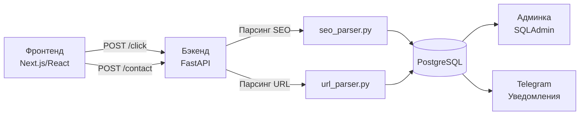

# Требования к фронтенду: SEO-аналитика

> Документ для фронтенд-разработчика (React/Next.js). Все пояснения написаны так, чтобы реализовать требования без дополнительных вопросов.

---

## 1. Обзор архитектуры



**Ключевой принцип:** Фронтенд только **передаёт** данные. Бэкенд **парсит** всё сам (search engine, бот, устройство, UTM из referer). Фронтенту НЕ нужно парсить user-agent, referer, определять тип устройства и т.д.

---

## 2. API-контракты

### 2.1. POST /click — сбор кликов

**URL:** `POST {API_BASE}/click`
**Content-Type:** `application/json`

```typescript
interface ClickProps {
  url?: string;                    // Текущий URL страницы (window.location.href)
  utm_source?: string;            // UTM source из URL
  utm_medium?: string;            // UTM medium
  utm_campaign?: string;          // UTM campaign
  utm_term?: string;              // UTM term
  utm_content?: string;           // UTM content
  attribution?: {                  // Данные атрибуции — Journey Chain
    journey?: Array<{
      url: string;
      timestamp: string;
      referrer?: string;
    }>;
    device?: {
      screen: string;              // напр. "1920x1080"
      platform: string;            // navigator.platform
      language: string;            // navigator.language
    };
    entry?: {
      url: string;                 // URL первого визита
      referrer?: string;           // document.referrer при первом визите
      timestamp: string;           // ISO 8601
    };
    form?: {
      timeOnPage: number;          // секунды на странице
      scrollDepth: number;         // % прокрутки
      interactions: number;        // количество кликов/действий
    };
    visits?: number;               // счётчик визитов
    firstVisit?: string;           // ISO 8601 дата первого визита
    lastVisit?: string;            // ISO 8601 дата последнего визита
    createdAt?: string;            // ISO 8601 когда attribution создан
  };
}
```

**Ответ бэкенда:**
```json
{ "status": "ok" }
```

---

### 2.2. POST /contact — сбор заявок

**URL:** `POST {API_BASE}/contact`
**Content-Type:** `application/json`

```typescript
interface ContactModel {
  telegram: string;               // ОБЯЗАТЕЛЬНО: Telegram-username клиента
  text: string;                   // ОБЯЗАТЕЛЬНО: Текст заявки
  name: string;                   // ОБЯЗАТЕЛЬНО: Имя клиента
  email?: string;                 // Email (необязательно)
  phone?: string;                 // Телефон (необязательно)
  url?: string;                   // Текущий URL страницы (window.location.href)
  attribution?: AttributionModel; // Такая же модель, как в ClickProps
}
```

**Ответ бэкенда:**
```json
{ "status": "ok" }
```

---

## 3. Обязательные требования

Это то, что фронтенд **ДОЛЖЕН** реализовать. Без этих требований аналитика не работает.

### 3.1. Отправка клика при загрузке каждой страницы

- **Что:** Отправлять `POST /click` при загрузке **каждой** страницы.
- **Когда:** При первом рендере страницы + при каждом route change в SPA.
- **Почему:** Каждый клик — это запись в БД, по которой строится вся аналитика.

### 3.2. Передача URL — КРИТИЧНО

- **Что:** В поле `url` передавать **полный** `window.location.href`.
- **Пример:** `https://dima-razrab.com/works/my-project?ref=home`
- **Почему:** Бэкенд парсит "хвостик" URL (`/works/my-project`) для автоматической привязки клика к конкретной работе или категории. Без URL привязка невозможна.

```typescript
// ОБЯЗАТЕЛЬНО — передавать в каждом запросе
{ url: window.location.href }
```

### 3.3. Отправка заявки с URL

- **Что:** При отправке формы заявки вызывать `POST /contact` с обязательными полями `telegram`, `text`, `name` + поле `url: window.location.href`.
- **Почему:** URL позволяет привязать заявку к конкретной странице/работе, откуда клиент пришёл.

---

## 4. Рекомендуемые требования

Это **усилит** аналитику, но не является обязательным для работы.

### 4.1. Парсинг UTM-меток

- **Что:** Парсить UTM-параметры из `window.location.search` и передавать в поля `utm_source`, `utm_medium`, `utm_campaign`, `utm_term`, `utm_content`.
- **Почему:** UTM из фронтенда **приоритетнее** парсинга бэкендом из referer. Если фронтенд передал `utm_source` — бэкенд использует его, а не свой парсинг.
- **Когда передавать:** Только если они реально есть в URL (не передавать пустые строки).

### 4.2. Attribution (Journey Chain)

- **Что:** Собирать и передавать в поле `attribution` данные о пути пользователя по сайту.
- **Зачем:** Позволяет видеть, какие страницы посетил клиент до заявки, сколько визитов было, когда был первый визит.
- **Реализация:** Хранить данные в `localStorage`, обновлять при каждом визите.

### 4.3. Сохранение между визитами

- **Что:** Сохранять в `localStorage`:
  - `journey` — массив посещённых URL с timestamps
  - `visits` — счётчик визитов
  - `firstVisit` — дата первого визита
  - `lastVisit` — дата последнего визита
  - `entry` — URL и referrer первого визита
- **Почему:** Позволяет отслеживать возвращающихся клиентов и их путь.

---

## 5. Код трекера — `seoTracker.ts`

Готовый модуль для интеграции. Все функции работают fire-and-forget (не блокируют UI).

### 5.1. Полный код модуля

```typescript
// src/utils/seoTracker.ts

const API_BASE = process.env.NEXT_PUBLIC_API_URL || 'https://dima-razrab.com';
const STORAGE_KEY = 'seo_attribution';
const MAX_JOURNEY_LENGTH = 50;

// ============================================
// Types
// ============================================

interface JourneyEntry {
  url: string;
  timestamp: string;
  referrer?: string;
}

interface AttributionData {
  journey?: JourneyEntry[];
  device?: {
    screen: string;
    platform: string;
    language: string;
  };
  entry?: {
    url: string;
    referrer?: string;
    timestamp: string;
  };
  form?: {
    timeOnPage: number;
    scrollDepth: number;
    interactions: number;
  };
  visits?: number;
  firstVisit?: string;
  lastVisit?: string;
  createdAt?: string;
}

interface ClickPayload {
  url?: string;
  utm_source?: string;
  utm_medium?: string;
  utm_campaign?: string;
  utm_term?: string;
  utm_content?: string;
  attribution?: AttributionData;
}

interface ContactPayload {
  telegram: string;
  text: string;
  name: string;
  email?: string;
  phone?: string;
  url?: string;
  attribution?: AttributionData;
}

// ============================================
// UTM Parsing
// ============================================

/**
 * Парсит UTM-метки из текущего URL.
 * Возвращает объект с utm_* полями (только непустые).
 */
export function parseUTMParams(): Partial<ClickPayload> {
  if (typeof window === 'undefined') return {};

  const params = new URLSearchParams(window.location.search);
  const utmKeys = ['utm_source', 'utm_medium', 'utm_campaign', 'utm_term', 'utm_content'] as const;
  const result: Partial<ClickPayload> = {};

  for (const key of utmKeys) {
    const value = params.get(key);
    if (value && value.trim()) {
      result[key] = value.trim();
    }
  }

  return result;
}

// ============================================
// Attribution (Journey Chain)
// ============================================

/**
 * Загружает attribution из localStorage.
 */
function loadAttribution(): AttributionData {
  if (typeof window === 'undefined') return {};

  try {
    const stored = localStorage.getItem(STORAGE_KEY);
    if (stored) {
      return JSON.parse(stored);
    }
  } catch {
    // Игнорируем ошибки парсинга
  }

  return {};
}

/**
 * Сохраняет attribution в localStorage.
 */
function saveAttribution(data: AttributionData): void {
  if (typeof window === 'undefined') return;

  try {
    localStorage.setItem(STORAGE_KEY, JSON.stringify(data));
  } catch {
    // Игнорируем ошибки localStorage
  }
}

/**
 * Обновляет attribution данными текущего визита.
 * Вызывается при каждом page view.
 */
function updateAttribution(url: string): AttributionData {
  const now = new Date().toISOString();
  const stored = loadAttribution();

  // Счётчик визитов
  const visits = (stored.visits || 0) + 1;

  // Journey chain — добавляем текущий URL
  const journey = stored.journey || [];
  journey.push({
    url,
    timestamp: now,
    referrer: typeof document !== 'undefined' ? document.referrer || undefined : undefined,
  });
  // Ограничиваем длину
  if (journey.length > MAX_JOURNEY_LENGTH) {
    journey.splice(0, journey.length - MAX_JOURNEY_LENGTH);
  }

  // Entry point — только при первом визите
  const entry = stored.entry || {
    url,
    referrer: typeof document !== 'undefined' ? document.referrer || undefined : undefined,
    timestamp: now,
  };

  // Device info — собираем один раз
  const device = stored.device || {
    screen: typeof screen !== 'undefined' ? `${screen.width}x${screen.height}` : 'unknown',
    platform: typeof navigator !== 'undefined' ? navigator.platform : 'unknown',
    language: typeof navigator !== 'undefined' ? navigator.language : 'unknown',
  };

  const attribution: AttributionData = {
    journey,
    device,
    entry,
    visits,
    firstVisit: stored.firstVisit || now,
    lastVisit: now,
    createdAt: stored.createdAt || now,
  };

  saveAttribution(attribution);
  return attribution;
}

// ============================================
// Scroll & Interaction Tracking
// ============================================

let scrollDepth = 0;
let interactionCount = 0;
let pageLoadTime = Date.now();

/**
 * Отслеживает глубину прокрутки.
 */
function initScrollTracking(): void {
  if (typeof window === 'undefined') return;

  const handler = () => {
    const scrollTop = window.scrollY || document.documentElement.scrollTop;
    const docHeight = document.documentElement.scrollHeight - window.innerHeight;
    if (docHeight > 0) {
      scrollDepth = Math.max(scrollDepth, Math.round((scrollTop / docHeight) * 100));
    }
  };

  window.addEventListener('scroll', handler, { passive: true });
}

/**
 * Отслеживает взаимодействия (клики).
 */
function initInteractionTracking(): void {
  if (typeof window === 'undefined') return;

  const handler = () => {
    interactionCount++;
  };

  document.addEventListener('click', handler);
}

/**
 * Возвращает текущие данные формы (время, прокрутка, клики).
 */
function getFormData() {
  return {
    timeOnPage: Math.round((Date.now() - pageLoadTime) / 1000),
    scrollDepth,
    interactions: interactionCount,
  };
}

/**
 * Сбрасывает счётчики при смене страницы.
 */
function resetPageMetrics(): void {
  scrollDepth = 0;
  interactionCount = 0;
  pageLoadTime = Date.now();
}

// ============================================
// Public API
// ============================================

/**
 * Собирает полные данные attribution.
 */
export function buildAttribution(): AttributionData {
  if (typeof window === 'undefined') return {};

  const attribution = updateAttribution(window.location.href);

  // Добавляем данные формы
  attribution.form = getFormData();

  return attribution;
}

/**
 * Отправляет клик на бэкенд.
 * Fire-and-forget — не блокирует UI.
 */
export function trackPageView(): void {
  if (typeof window === 'undefined') return;

  // Обновляем attribution
  const attribution = buildAttribution();

  // Парсим UTM
  const utm = parseUTMParams();

  const payload: ClickPayload = {
    url: window.location.href,
    ...utm,
    attribution,
  };

  // Fire-and-forget
  fetch(`${API_BASE}/click`, {
    method: 'POST',
    headers: { 'Content-Type': 'application/json' },
    body: JSON.stringify(payload),
    keepalive: true,
  }).catch(() => {
    // Игнорируем ошибки — не критично
  });

  // Сбрасываем счётчики страницы
  resetPageMetrics();
}

/**
 * Отправляет заявку на бэкенд.
 * Возвращает Promise — можно показать статус отправки.
 */
export async function trackContact(formData: {
  telegram: string;
  text: string;
  name: string;
  email?: string;
  phone?: string;
}): Promise<{ status: string }> {
  const attribution = buildAttribution();

  const payload: ContactPayload = {
    ...formData,
    url: window.location.href,
    attribution,
  };

  const response = await fetch(`${API_BASE}/contact`, {
    method: 'POST',
    headers: { 'Content-Type': 'application/json' },
    body: JSON.stringify(payload),
  });

  return response.json();
}

/**
 * Инициализирует трекинг скролла и взаимодействий.
 * Вызвать один раз при монтировании приложения.
 */
export function initTracker(): void {
  if (typeof window === 'undefined') return;

  initScrollTracking();
  initInteractionTracking();
}
```

---

## 6. Интеграция с Next.js

### 6.1. App Router (`app/layout.tsx`)

```tsx
// app/layout.tsx
'use client';

import { useEffect } from 'react';
import { usePathname, useSearchParams } from 'next/navigation';
import { initTracker, trackPageView } from '@/utils/seoTracker';

export default function RootLayout({
  children,
}: {
  children: React.ReactNode;
}) {
  const pathname = usePathname();
  const searchParams = useSearchParams();

  // Инициализация трекера — один раз
  useEffect(() => {
    initTracker();
  }, []);

  // Отслеживание route change
  useEffect(() => {
    // Небольшая задержка чтобы URL обновился
    const timer = setTimeout(() => {
      trackPageView();
    }, 100);

    return () => clearTimeout(timer);
  }, [pathname, searchParams]);

  return (
    <html lang="ru">
      <body>{children}</body>
    </html>
  );
}
```

### 6.2. Pages Router (`pages/_app.tsx`)

```tsx
// pages/_app.tsx
import { useEffect } from 'react';
import { useRouter } from 'next/router';
import { initTracker, trackPageView } from '@/utils/seoTracker';
import type { AppProps } from 'next/app';

export default function App({ Component, pageProps }: AppProps) {
  const router = useRouter();

  // Инициализация — один раз
  useEffect(() => {
    initTracker();
    // Первый page view
    trackPageView();
  }, []);

  // Route change tracking
  useEffect(() => {
    const handleRouteChange = () => {
      trackPageView();
    };

    router.events.on('routeChangeComplete', handleRouteChange);
    return () => {
      router.events.off('routeChangeComplete', handleRouteChange);
    };
  }, [router.events]);

  return <Component {...pageProps} />;
}
```

### 6.3. Пример отправки заявки

```tsx
// components/ContactForm.tsx
'use client';

import { useState } from 'react';
import { trackContact } from '@/utils/seoTracker';

export function ContactForm() {
  const [status, setStatus] = useState<'idle' | 'sending' | 'ok' | 'error'>('idle');

  const handleSubmit = async (e: React.FormEvent<HTMLFormElement>) => {
    e.preventDefault();
    const form = e.currentTarget;

    setStatus('sending');

    try {
      await trackContact({
        name: (form.elements.namedItem('name') as HTMLInputElement).value,
        telegram: (form.elements.namedItem('telegram') as HTMLInputElement).value,
        text: (form.elements.namedItem('text') as HTMLTextAreaElement).value,
        email: (form.elements.namedItem('email') as HTMLInputElement)?.value || undefined,
        phone: (form.elements.namedItem('phone') as HTMLInputElement)?.value || undefined,
      });
      setStatus('ok');
    } catch {
      setStatus('error');
    }
  };

  return (
    <form onSubmit={handleSubmit}>
      <input name="name" placeholder="Имя" required />
      <input name="telegram" placeholder="Telegram @" required />
      <input name="email" placeholder="Email" type="email" />
      <input name="phone" placeholder="Телефон" type="tel" />
      <textarea name="text" placeholder="Опишите задачу" required />
      <button type="submit" disabled={status === 'sending'}>
        {status === 'sending' ? 'Отправка...' : 'Отправить'}
      </button>
      {status === 'ok' && <p>Заявка отправлена!</p>}
      {status === 'error' && <p>Ошибка отправки. Попробуйте позже.</p>}
    </form>
  );
}
```

---

## 7. Важные замечания

### 7.1. URL — полный путь

URL **ДОЛЖЕН** содержать полный путь. Бэкенд парсит "хвостик" URL для привязки к работам/категориям:

```
✅ https://dima-razrab.com/works/my-project    → entity_type='work', slug='my-project'
✅ https://dima-razrab.com/categories/python    → entity_type='category', slug='python'
✅ https://dima-razrab.com/about                → entity_type=None (обычная страница)
❌ /works/my-project                            → может не сработать, нужен полный URL
```

### 7.2. Не отправлять клики для ботов

Бэкенд **сам** определяет ботов по user-agent и ставит `is_bot=True`, но если хотите сэкономить запросы:

```typescript
// Опционально: не отправлять клики для простых ботов
const isLikelyBot = /bot|crawler|spider|lighthouse/i.test(navigator.userAgent);
if (!isLikelyBot) {
  trackPageView();
}
```

### 7.3. CORS

Бэкенд разрешает все origins (`*`). Проблем с CORS не будет.

### 7.4. Fire-and-forget

Клик (`POST /click`) отправляется **без** `await` — не блокируйте UI и не показывайте спиннер. Если запрос упадёт — ничего страшного, аналитика не критична.

Заявка (`POST /contact`) — **с** `await`, т.к. пользователь ждёт подтверждения отправки.

### 7.5. Базовый URL API

Задайте переменную окружения:

```env
NEXT_PUBLIC_API_URL=https://dima-razrab.com
```

Или захардкодьте в [`seoTracker.ts`](src/utils/seoTracker.ts) если нет доступа к env.

---

## 8. Какие URL бэкенд умеет парсить

Бэкенд автоматически определяет `entity_type` и `entity_id` из URL:

| URL | entity_type | entity_slug | Примечание |
|-----|-------------|-------------|------------|
| `/works/my-project` | `work` | `my-project` | Ищет работу по slug |
| `/work/my-project` | `work` | `my-project` | Альтернативный паттерн |
| `/works/my-project?ref=home` | `work` | `my-project` | Query-параметры игнорируются |
| `/categories/python` | `category` | `python` | Ищет категорию по slug |
| `/category/python` | `category` | `python` | Альтернативный паттерн |
| `/about` | `None` | `None` | Обычная страница |
| `/` | `None` | `None` | Главная |
| `/works/` | `None` | `None` | Список работ (без slug) |

---

## 9. Таблица соответствия: что фронтенд передаёт vs что бэкенд определяет сам

| Данные | Фронтенд передаёт? | Бэкенд определяет? | Источник |
|--------|--------------------|--------------------|----------|
| `url` | **ДА (обязательно)** | Нет | `window.location.href` |
| `utm_source` | Рекомендуется | Да, из URL/referer | URL query params |
| `utm_medium` | Рекомендуется | Да, из URL/referer | URL query params |
| `utm_campaign` | Рекомендуется | Да, из URL/referer | URL query params |
| `utm_term` | Рекомендуется | Да, из URL/referer | URL query params |
| `utm_content` | Рекомендуется | Да, из URL/referer | URL query params |
| `search_engine` | Нет | **Да** | referer header |
| `search_query` | Нет | **Да** | referer header |
| `is_bot` | Нет | **Да** | user-agent header |
| `device_type` | Нет | **Да** | user-agent header |
| `browser` | Нет | **Да** | user-agent header |
| `os` | Нет | **Да** | user-agent header |
| `entity_type` | Нет | **Да** | URL path parsing |
| `entity_id` | Нет | **Да** | БД lookup по slug |
| `attribution` | Рекомендуется | Нет | localStorage |

**Правило:** Фронтенд передаёт `url` + опционально `utm_*` и `attribution`. Всё остальное бэкенд определяет сам из HTTP-заголовков запроса.

---

## 10. Фаза 1: Продвинутый трекинг — требования к фронтенду

### 10.1. Новый API: POST /event

Бэкенд принимает пакет событий по адресу `POST /event` (application/json). Фронтенд собирает события и отправляет пакетами (батчами) каждые 10-15 секунд или при уходе со страницы.

#### Структура запроса:

```typescript
interface BatchEvent {
  events?: PageEvent[];           // События на странице
  micro_conversions?: MicroConversion[];  // Микроконверсии
  cta_clicks?: CtaClick[];        // Клики по CTA
}

interface PageEvent {
  session_id?: string;            // ID сессии (localStorage)
  url: string;                    // window.location.href
  event_type: string;             // scroll_depth | rage_click | dead_click | time_on_page
  value?: string;                 // Значение: "25"/"50"/"75"/"100", селектор, секунды
}

interface MicroConversion {
  session_id?: string;
  url: string;
  conversion_type: string;        // portfolio_open | work_click | form_scroll | cta_visible
  element_selector?: string;      // CSS селектор элемента
}

interface CtaClick {
  session_id?: string;
  url: string;
  cta_id: string;                 // telegram-header | contact-form | email-footer | tech-stack
  cta_text?: string;              // Текст кнопки
}
```

---

### 10.2. Scroll Depth — отслеживание глубины прокрутки

**Реализация на фронтенде:**

```typescript
// Добавить в seoTracker.ts
function initScrollTracking(): void {
  const thresholds = [25, 50, 75, 100];
  const triggered = new Set<number>();

  window.addEventListener('scroll', () => {
    const scrollPct = Math.round(
      (window.scrollY / (document.documentElement.scrollHeight - window.innerHeight)) * 100
    );
    for (const t of thresholds) {
      if (scrollPct >= t && !triggered.has(t)) {
        triggered.add(t);
        addEvent({ url: location.href, event_type: 'scroll_depth', value: String(t) });
      }
    }
  }, { passive: true });
}
```

**Сброс:** При каждом route change сбрасывать `triggered` Set.

---

### 10.3. Time on Page — время на странице

```typescript
// Добавить в seoTracker.ts
let pageLoadTime: number;

function initTimeTracking(): void {
  pageLoadTime = performance.now();
  
  const sendTime = () => {
    const seconds = Math.round((performance.now() - pageLoadTime) / 1000);
    if (seconds > 2) {  // Игнорируем < 2 сек (bounce)
      addEvent({ url: location.href, event_type: 'time_on_page', value: String(seconds) });
    }
  };
  
  window.addEventListener('beforeunload', sendTime);
  document.addEventListener('visibilitychange', () => {
    if (document.visibilityState === 'hidden') sendTime();
  });
}
```

---

### 10.4. Rage Clicks — обнаружение фрустрации

```typescript
// Добавить в seoTracker.ts
function initRageClickDetection(): void {
  const clickBuffer: Array<{ target: Element; time: number }> = [];
  
  document.addEventListener('click', (e) => {
    const target = e.target as Element;
    const now = Date.now();
    
    // Очищаем старые клики (> 1 сек)
    while (clickBuffer.length && now - clickBuffer[0].time > 1000) {
      clickBuffer.shift();
    }
    
    // Проверяем: 3+ клика по одному элементу за 1 сек
    const sameTarget = clickBuffer.filter(c =>
      c.target === target || c.target.contains(target) || target.contains(c.target)
    );
    
    if (sameTarget.length >= 2) {  // 3 клика всего (2 в буфере + текущий)
      const selector = getSelector(target);
      addEvent({ url: location.href, event_type: 'rage_click', value: selector });
      clickBuffer.length = 0;  // Очищаем
      return;
    }
    
    clickBuffer.push({ target, time: now });
  });
}

function getSelector(el: Element): string {
  if (el.id) return `#${el.id}`;
  if (el.className) return `.${el.className.split(' ')[0]}`;
  return el.tagName.toLowerCase();
}
```

---

### 10.5. Dead Clicks — клики по неинтерактивным элементам

```typescript
// Добавить в seoTracker.ts
function initDeadClickDetection(): void {
  document.addEventListener('click', (e) => {
    const target = e.target as Element;
    const interactive = target.closest('a, button, [role="button"], [onclick], input, select, textarea');
    
    if (!interactive) {
      const selector = getSelector(target);
      addEvent({ url: location.href, event_type: 'dead_click', value: selector });
    }
  });
}
```

---

### 10.6. Micro-Conversions — промежуточные действия

**На фронтенде нужно добавить data-атрибуты на ключевые элементы:**

```html
<!-- Примеры атрибутов на элементах -->
<div data-micro-conversion="portfolio-open">...</div>
<a data-micro-conversion="work-click" href="/works/xxx">...</a>
<section data-micro-conversion="form-scroll">Форма контактов</section>
<button data-micro-conversion="cta-visible">Написать в Telegram</button>
```

**JavaScript обработчик:**

```typescript
// Добавить в seoTracker.ts
function initMicroConversionTracking(): void {
  // Клики
  document.addEventListener('click', (e) => {
    const target = (e.target as Element).closest('[data-micro-conversion]');
    if (target) {
      addMicroConversion({
        url: location.href,
        conversion_type: target.getAttribute('data-micro-conversion')!,
        element_selector: getSelector(target),
      });
    }
  });
  
  // Скролл до формы (IntersectionObserver)
  const formEl = document.querySelector('[data-micro-conversion="form-scroll"]');
  if (formEl) {
    const observer = new IntersectionObserver((entries) => {
      entries.forEach(entry => {
        if (entry.isIntersecting) {
          addMicroConversion({
            url: location.href,
            conversion_type: 'form_scroll',
          });
          observer.disconnect();
        }
      });
    }, { threshold: 0.5 });
    observer.observe(formEl);
  }
}
```

---

### 10.7. CTA Tracking — клики по CTA-кнопкам

**На фронтенде нужно добавить data-атрибуты на CTA:**

```html
<!-- Примеры -->
<a href="https://t.me/xxx" data-cta-id="telegram-header">Написать в Telegram</a>
<button data-cta-id="contact-form" type="submit">Отправить заявку</button>
<a href="mailto:xxx" data-cta-id="email-footer">Email</a>
```

**JavaScript обработчик:**

```typescript
// Добавить в seoTracker.ts
function initCtaTracking(): void {
  document.addEventListener('click', (e) => {
    const target = (e.target as Element).closest('[data-cta-id]');
    if (target) {
      addCtaClick({
        url: location.href,
        cta_id: target.getAttribute('data-cta-id')!,
        cta_text: target.textContent?.trim().substring(0, 200),
      });
    }
  });
}
```

---

### 10.8. Session ID — идентификатор сессии

```typescript
// Добавить в seoTracker.ts
function getSessionId(): string {
  let sid = localStorage.getItem('seo_session_id');
  if (!sid) {
    sid = 'sess_' + Math.random().toString(36).substring(2, 15) + Date.now().toString(36);
    localStorage.setItem('seo_session_id', sid);
  }
  return sid;
}
```

---

### 10.9. Батчинг — отправка событий пакетами

```typescript
// Добавить в seoTracker.ts
const eventBuffer: BatchEvent = { events: [], micro_conversions: [], cta_clicks: [] };

function addEvent(evt: Omit<PageEvent, 'session_id'>): void {
  eventBuffer.events!.push({ ...evt, session_id: getSessionId() });
}

function addMicroConversion(mc: Omit<MicroConversion, 'session_id'>): void {
  eventBuffer.micro_conversions!.push({ ...mc, session_id: getSessionId() });
}

function addCtaClick(cta: Omit<CtaClick, 'session_id'>): void {
  eventBuffer.cta_clicks!.push({ ...cta, session_id: getSessionId() });
}

function flushEvents(): void {
  if (!eventBuffer.events!.length && !eventBuffer.micro_conversions!.length && !eventBuffer.cta_clicks!.length) return;
  
  const API_URL = 'https://dima-razrab.com/event';  // или http://localhost:8000/event
  navigator.sendBeacon(API_URL, JSON.stringify(eventBuffer));
  
  // Очищаем буфер
  eventBuffer.events = [];
  eventBuffer.micro_conversions = [];
  eventBuffer.cta_clicks = [];
}

// Отправляем каждые 15 секунд
setInterval(flushEvents, 15000);

// Отправляем при уходе со страницы
window.addEventListener('beforeunload', flushEvents);
```

---

### 10.10. Инициализация — initTracker()

```typescript
// Обновить initTracker() в seoTracker.ts
export function initTracker(): void {
  trackPageView();           // Существующий трекинг кликов
  initScrollTracking();      // НОВОЕ: скролл
  initTimeTracking();        // НОВОЕ: время на странице
  initRageClickDetection();  // НОВОЕ: rage clicks
  initDeadClickDetection();  // НОВОЕ: dead clicks
  initMicroConversionTracking(); // НОВОЕ: микроконверсии
  initCtaTracking();         // НОВОЕ: CTA клики
}
```

---

### 10.11. Чеклист data-атрибутов для фронтенда

| Элемент | Атрибут | Значение |
|---------|---------|----------|
| Блок портфолио | `data-micro-conversion` | `portfolio-open` |
| Ссылка на работу | `data-micro-conversion` | `work-click` |
| Секция формы контактов | `data-micro-conversion` | `form-scroll` |
| Кнопка Telegram (хедер) | `data-cta-id` | `telegram-header` |
| Кнопка отправки формы | `data-cta-id` | `contact-form` |
| Ссылка email (футер) | `data-cta-id` | `email-footer` |
| Блок технологий | `data-cta-id` | `tech-stack` |
| Кнопка "Посмотреть работу" | `data-cta-id` | `view-work` |

---

## 11. Чеклист перед релизом

- [ ] `POST /click` отправляется при загрузке каждой страницы
- [ ] В каждом запросе передаётся `url: window.location.href`
- [ ] `POST /contact` отправляется с обязательными полями + `url`
- [ ] URL содержит полный путь (не относительный)
- [ ] Клики отправляются fire-and-forget (без await)
- [ ] Заявки отправляются с await и показом статуса
- [ ] Трекинг скролла и взаимодействий работает
- [ ] Attribution сохраняется в localStorage
- [ ] UTM-метки парсятся из URL и передаются
- [ ] Переменная `NEXT_PUBLIC_API_URL` настроена
